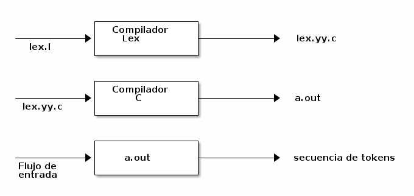
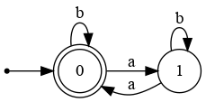
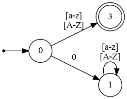

# Generadores de Analizadores Léxicos:

(tiger)
La construcción de un DFA es una tarea mecánica que fácilmente puede ser realizad por una computadora, por eso tiene sentido que existan programas capaces de generar un analizador léxico que traduzca las expresiones regulares en un DFA. 

El generador de analizadores léxicos más famoso se llama **lex** creado por Mike Lesk y Eric Schmidt
cuya primera versión fue liberada en 1975, hace 46 años. Lex produce un  programa en C a partir de una especificación léxica.  

-   Para cada tipo de token en el lenguaje de programación a ser analizado léxicamente, esta especificación contiene una expresión regular y una acción.

-   La acción comunica el tipo de token y posiblemente varias otras cosas la próxima fase de compilación. 
    -   Existen otros generadores automáticos de analizadores léxicos:
        -   lex : se utiliza en Unix y normalmente generan el analizador en código C.
        
        -   flex : se utiliza generalmente para generar el analizador léxico Flex (fast lexical analyzer generator).
        
        -   Antlr: ANother Tool for Language Recognition, genera código Java, C, C++, C#, Python, Perl, Delphi, Ada95, JavaScript y Objective-C.


### Lex

El funcionamiento de lex es el siguiente:



-   Básicamente el funcionamiento de lex tiene tres partes:
    -   Generar un analizador léxico escrito en C a partir de una especificación léxica ( un propio lenguaje) en un archivo.
    
    -   Compilar el analizador léxico generado por lex llamado **lex.yy.c** y obtener el código ejecutable.
    
    -   Ejecutar ese programa para obtener los tokens a partir de un flujo de entrada.

1.  Sintaxis de Expresiones Regulares Lex

    Tabla de expresiones utilizadas por lex :
    
2.  Estructura de un Archivo Lex

    Un archivo lex tiene la siguiente estructura:
    
    
        %{
          (Código del preprocesador de C)
        %}
          (Declaraciones)
        %% 
          (Expresiones Regulares)
        %% 
          (Código adicional)
    
   En la sección de Código de preprocesador se incluirán todas las directivas de del preprocesador de C que incluirá el lex.yy.c
   
   En la sección de declaraciones se pueden incluir distintos tipos de variables, tipos y constantes que se utilizaran en el lex.yy.c
   
   En la sección de expresiones regulares, cada regla de traducción se escribe de la siguiente forma:
        

  Patrón { Acción }
        
Cada **Patrón** es una expresión regular.

Las **Acciones** son fragmento de código, por lo general C,
    
- Se instala en ubuntu :

```
        $> sudo apt install flex
```

### 1.  Hola Mundo en lex

%%
 "hola mundo"  printf("GOODBY\n");
 . ;
%%
        
Este archivo reconoce el string hola mundo y al hacerlo imprime "GOODBY". A continuación se muestra como debe compilarse.
        
$>flex lexer.l
$>gcc -g -Wall -Wconversion -std=c99 lex.yy.c lex.yy.c
    
### 2.  Obtener los String con Cantidad Par de Letras "a"

Sea la expresión regular que reconoce todos los string que contienen una cantidad par de letras a, sobre el alfabeto &Sigma;={a,b}. Dicha expresión es: (b&lowast;()ab&lowast;()a)&lowast;, esta expresión regular puede ser representada por el DFA que se muestra a continuación:
        


a continuación se construye el archivo flex que representa la funcionalidad del autómata:

```        
%%
(b*ab*a)*  printf("cantidad par de letras a\n");
. ;
%%
```

Este archivo reconoce cualquier string que contenga cumpla con la expresion regular  y al hacerlo imprime "cantidad par de letras a". A continuación se muestra como debe compilarse.

```   
$>flex lexer.l
$>gcc -g -Wall -Wconversion -std=c99 lex.yy.c lex.yy.c
```

### 3.  Reconocer los Strings que no inician con un 0

La expresión regular para ese patrón es r=<sup>(?!0)</sup>[a-zA-Z]+., a continuación el FDA que cumple con esa expresión regular es:
        


a continuación se construye el archivo flex que representa la funcionalidad del autómata:
```        
%%
(^0[a-z]*)  printf("error\n");
.           printf("El string no inicia con 0\n";
%%
```
Este archivo reconoce cualquier string que contenga cumpla con la expresión regular  y al hacerlo imprime "cantidad par de letras a". A continuación se muestra como debe compilarse.
        
            $>flex lexer.l
            $>gcc -g -Wall -Wconversion -std=c99 lex.yy.c lex.yy.c

3.  Flex más Avanzado

    Algunas definiciones útiles que pueden ser utilizadas:
    
    1.  **yylex()**: esta función es la que es llamada cada vez que se quiere obtener un token, cada vez que se llama esta devuelve un token. Es secuencial una vez que inicia no puede volverse atrás en el stream de caracteres.
    
    2.  **yytext**: cada vez que el lexer reconoce un token, este se almacena en un string terminado en \\0 , llamado yytext.
    
    3.  **yyleng**: equivale a strlen(yytext).
    
    4.  **yywrap()**: Cada vez que el lexer encuentra un fin de archivo este llama opcionalmente a la rutina yywrap().
    
    -   Como se maneja la ambigüedad, la misma se maneja con dos reglas:
        -   Se busca matchear el string más largo cada vez que el lexer escanea el input
        
        -   En el caso de un loop se elige el patron que aparece primero.
    
    1.  Reconocer Números y  Operaciones Aritméticas
    
        Este ejemplo es un poco más complejo y se pide reconocer números naturales y las operaciones aritméticas básicas {+,-,\*,/}. Para ello se deben obtener algunas expresiones regulares:
        
        -   Los números naturalles: [1-9]+
        
        -   Las operaciones: [=,\\,/,\*]
        
        -   Los blancos: [ \t\n]
    
```
            %{
            #include <stdlib.h>
            %}
            
            %%
            [1-9]+  { return atoi(yytext);}
            [+-/*]  { return yytext[0];}
            [ \t\n] ;
            .       {return  127; }
            %%
            #include<stdio.h>
            
            int yywrap(void){}
            
            
            int main(){
            
                int val;
                
                while ( val=yylex() ) printf(" the value is %d",val);
            
            }
```

