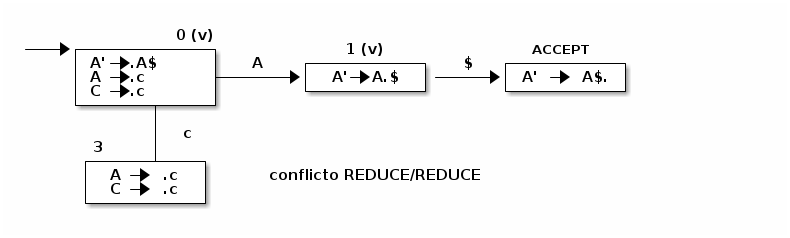
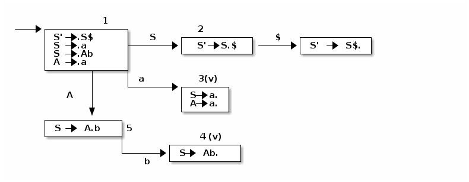
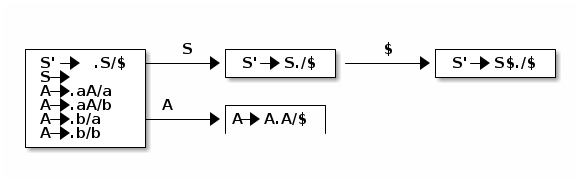
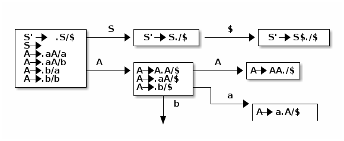

### Analizador Sintáctico SLR Canónico

-   En un tabla LR(0) cada celda solo puede contener a lo sumo una producción o celdas vacías. Esto asegura que dicha tabla puede realizar análisis sintáctico de gramáticas LR(0).

- Las tablas de análisis sintáctico LR(0) pueden tener conflictos:
  - Reduce / Reduce

  - Shift / Reduce

    

#### Conflicto Reduce/Reduce

Se producen cuando **hay** dos elementos A&rarr; &alpha;. en el mismo estado. 

Dada la gramática G=({A', A, C}, {c | $}, P A') con el siguiente conjunto de producciones:

A' &rarr; A$ 

A &rarr; c | C 

C &rarr; c

Se construye un autómata de las siguientes características


| estado    | A' | A | C | c           |
|--------- |--- |--- |--- |----------- |
| &#x2026;. |    |   |   |             |
| 3         |    |   |   | A&rarr;c / C&rarr;c |
|           |    |   |   |             |

#### Conflicto Shift/Reduce

Este tipo de conflicto se da cuando un elemento de la forma A&rarr; &alpha;. y un elemento que no tiene esa forma se encuentran en una misma celda de un estado.

G=({E',E,A}, {a,b$}, P ,E' ) cuyo conjunto de producciones es

E' &rarr; E$ 

E &rarr; A | Ab 

A &rarr; a | ab

En este caso hay ambigüedad en la gramática, al generar el autómata se obtiene:



El análisis sintáctico LR(0) puede presentar conflictos. Para ello se mejora el algoritmo utilizando el llamado SLR

### #Análisis Sintáctico Ascendente SLR

-   es una variante del LR(0), incrementa de manera importante la potencia del análisis al utilizar el token SIGUIENTE en la cadena de entrada para dirigir sus acciones.
-   Las Acciones REDUCE no ocupan todas la fila de la tabla.
-   Solamente se reduce por una producción A&rarr;&beta; para los símbolos terminales que puedan aparecer a continuación de A.
-   Se pone ACTION[q,a]=REDUCE(A&rarr;&beta;) solamente cuando a pertenece a SIGUIENTE(A).
-   La idea es cuando se completa la tabla se pone ACTION[q,a]=Reduce(A&rarr;&beta;) solo si a &isin; SIGUIENTE(A)
-   Esto evita conflictos:
    -   Reduce / Reduce
    -   Shift /Reduce

#### Ejemplo

Sea G=({S',A, S},{a,b,$},P,S' ). Con el conjunto P:

S' &rarr; S$ 

S &rarr; a | Ab 

A &rarr; a

Se genera el autómata LR(0):




Tabla LR

( recordar que cada vez que se tiene un elemento con un punto al final se ponene las acciones reduce en todos los no terminales.

| estado | S' | S | A | a           | b           | $           |             |
|------ |--- |--- |--- |----------- |----------- |----------- |----------- |
| 1      |    | 2 | 5 | S3          |             |             |             |
| 2      |    |   |   |             |             |             | Accept      |
| 3      |    |   |   | S&rarr;a / A&rarr;a | S->a / A&rarr;a | S&rarr;a / A&rarr;a | S&rarr;a / A&rarr;a |
| 4      |    |   |   | S&rarr;Ab | S&rarr;Ab | S&rarr;Ab |             |
| 5      |    |   |   |             | s4          |             |             |

No hay tabla LR(0) ya que hay un conflicto Reduce / Reduce en el estado 3

-   La idea es que las producciones no vayan en todas las filas, sino que las el elemento A &rarr; a. van en las columnas que contengan a SIGUIENTE(A)
    
    | No terminales | PRIMERO | SIGUIENTE |
    |------------- |------- |--------- |
    | S             | {a}     | {$}       |
    | A             | {a}     | {b}       |
    | S'            | {a}     | {$}       |
    |               |         |
    
    Se construye la tabla SLR teniendo en cuenta lo anterior

| estado | S' | S | A | a  | b    | $     |
|------ |--- |--- |--- |--- |---- |----- |
| 1      |    | 2 | 5 | S3 |      |       |
| 2      |    |   |   |    |      |       |
| 3      |    |   |   |    | A&rarr;a | S&rarr;a |
| 4      |    |   |   |    |      | S&rarr;ab |
| 5      |    |   |   |    | s4   |       |

-   Las gramáticas SLR no son ambiguas, pero hat gramáticas no ambiguas que no son SLR

G=({S,L,R}, {id,=,\*}), P, S)

S &rarr; L=R | R 

L &rarr; \* R | id 

R &rarr; L

### Analizador sintáctico LR(1) Canónico

-   Usa un token lookahead

-   El concepto detrás es el de refinar aun más el autómata: si el siguiente símbolo de la entrada es **a**, solo se debe reducir por **A &rarr; &beta;** cuando **a** podría venir a continuación de A

-   Está construido de tal forma que mantiene el registro de cual es el símbolo de debería venir a continuación tal que si A &rarr; &beta;. /a donde /a es el lookahead

## Elemento LR(1)

Un elemento LR(1) es un par [A &rarr;&alpha;.&beta; donde A &rarr; &alpha;&beta; es una producción y a &isin; |SigmaU {$} es un símbolo terminal.

-   Los estados de la tabla de Análisis Sintáctico LR(1) son Ahora conjuntos de elementos LR(1)
    -   La tabla se construye igual que la LR(0), la parte más importante es la definición de elemento LR(1) y su Clausura.

1. Clausura De un Elemento LR(1)

   Entrada: una gramática un conjunto de elementos LR(1)

   Salida: CLAUSURA(E)

   
```C
   J=E 
   while hay cambios 
      for each elemento [A-> alpha . beta,a] pertenece a J 
          for each producción B-> gamma 
              for each simbolo terminal b que pertenece a PRIMERO(betaa)                                   J=J U {[B-.gamma,b]} 
              end 
          end 
      end 
  end
```
3. Ejemplo :

Sea G=({S',S,A}, {a,b,$},P, S'). Donde P es

S' &rarr; S 

S &rarr; AA 

A &rarr; aA | b

Construir el autómata:

Primeros

| no terminal | Primero |
|----------- |------- |
| A           | {a,b]   |
| S           | {a,b}   |



Se hace la clausura




## Analizador Sintáctico LR con lectura  Anticipada LALR

   - El tamaño de la tabla LR(1) es muy grande, a pesar de que el método es muy poderoso.

   - Se define núcleo de un conjunto de elementos como al subconjunto de elementos que no son de la forma [A&rarr; .&beta;/a]

   - Una vez construido el autómata LR(1) se identifican los estados que tienen el mismo núcleo sin tener en cuenta el lookahead y se fusionan en un solo estado para reducirla cantidad de estados del autómata.
