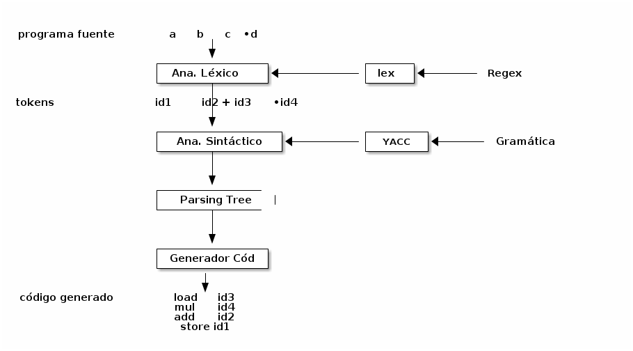

### Generadores de Analizadores Sintácticos

1. Yacc

   Yacc (Yet Another Compiler Compiler) esta herramienta permite especificar una gramática (libre de contexto) y genera un analizador sintáctico que **reconoce** oraciones validas de dicha gramática.

   1.  Yacc y Lex trabajan juntos:

       -   Lex: Realiza el análisis lexicográfico.
       
       -   Dado un stream de caracteres devuelve un stream de palabras clasificadas o tokens.
       
       -   Se definen en un archivo expresiones regulares y para cada expresión regular se escribe una o un conjunto de acciones asociadas a esa expresión regular:
       
       ```C
       
       [a-zA-Z][a-zA-Z0-9]+  {return COMMAND}
       
       ```
       
       -   Lex toma un archivo de entrada, **un stream de caracteres** transforma en un archivo de salida, **un stream de trokens**

   2. Yacc: Yet Another Compiler Compiler

      

      - Yacc genera un parser y un analizador semántico que generan el parseo y el correspondiente análisis, sobre el stream de tokens que produce lex. A medida que se está generando el análisis sintáctico va armando el **Árbol de Parsing** y también se puede realizar cierto análisis semántico con la misma herramienta.

        

      -   Bison: Esta herramienta es la versión de GNU, que es compatible con Yacc, pero además hace otras muchas cosas.

      

      El input de yacc es una **gramática libre de contexto**, el analizador sintáctico generado va a construir un **árbol de parsing**.

      

      -   mylang.y: define la gramática del lenguaje. Se puede definir tokens, tipos de tokens y eso se guarda en y.tab.h

      Una vez que se tienen definidos ambos archivos el de la gramática y el del analizador léxico, se compilan para generar o el interprete o el compilador.

      

   3. Un Archivo YACC

      La estructura de un archivo Yacc es muy similar a la estructura de los achivos lex:

      ```text
      Primera Parte
      %%
       producción   {accion}
      %%
      Tercera Parte
      ```

      1.  Primera Parte

          La primera parte del archivo de Yacc contiene:
          
          -   Declaraciones en C que están delimitadas por %{%}
          
          -   Definiciones específicas de Yacc
              -   %start
              -   %token
              -   %union (tokens de diferente tipos)
              -   %type (el tipo que puede tomar un token)

      2.  Producciones

          -   La sección del medio representa la gramática.
          
          -   las acciones asociadas a una producción ven entre {}
          
          Ejemplo:
          
          ```C
          
          statements: statement             {printf("statement");}
              	  | statement statements  {printf("statements \n");}
                    ;
          
          statement: identifier '+' identifier {printf("suma"); }
          
          statement: identifier '-' identifier {printf("resta"); }
          
          ```
          
          Un aspecto interesante de las producciones es que Yacc permite acceder a los valores que están asociados con los símbolos de las producciones:
          
          -   $1, $2, $3, &#x2026; $N : se refieren a los valores de los símbolos asociados a las producciones.
          
          -   $$ es el valor asociado al LHS
          
          -   Todos los símbolos tienen un valor asociado, sean terminales o no terminales.
          
          -   La asociación por defecto es $$=$1
          
          Entonces se puede escribir:
          
          ```C
          statement: identifier '+' identifier {$$ = $1 + $3; }
          
          statement: identifier '-' identifier {$$ = $1 - $3; }
          ```
          
          Representan la semántica de la producción.

   4.  Manos a la Obra

       En este ejemplo se desarrolla una calculadora muy básica
       
       mi gramática:
       
       ```text
       instruccion -> NOMBRE '=' expresion
       	     | expresion
       
       
       expresion: -> NUMERO '+' NUMERO
       	    | NUMERO '-' NUMERO
       	    | NUMERO
       ```
       
       Características:
       
       -   Reconocer las operaciones
       -   Evaluar los resultados
       
       mi\_lenguaje.y:
       
       ```C
       %{
       #include<stdio.h>
       
       extern int yylex(void);
       extern char * yytext;
       void yyerror(char * s);
       
       }%
       %token NOMBRE NUMERO
       %%
       instruccion: NOMBRE '=' expresion
       	   | expresion             {printf("= %d\n",$1);}
       	   ;
       
       expresion: NUMERO '+' NUMERO   {$$ = $1 + $3;}
       	 | NUMERO '-' NUMERO   {$$ = $1 - $3;}
       	 | NUMERO              {$$ = $1;}
       	 ;
       %%
       void yyerror (char *s){
          printf("%s",s);
       }
       
       
       int main(){
          yyparse();
          return 0;
       }
       
       ```
       
       mi\_lenguaje.l:
       
       ```C
       %{
       #include<stdlib.h>    
       #include "y.tab.h"
       extern int yylval;
       %}
       
       %% 
       [0-9]+       { yylval=atoi(yytext); return NUMERO;}
       [ \t] ;
       \n           return 0;   //EOF  
       .            return yytext[0];
       %%
       ```
