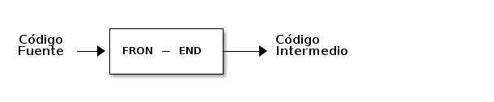
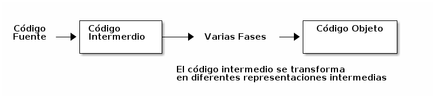
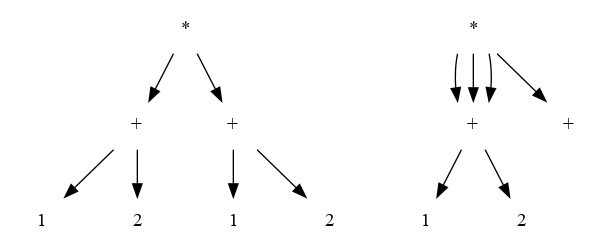
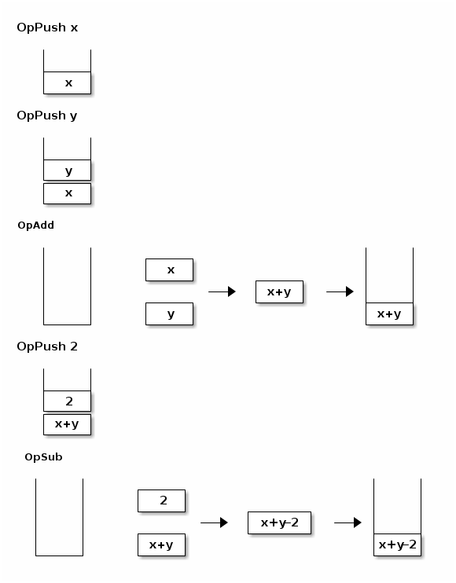

## Generación de Código Intermedio






#### Traducción dirigida por la sintaxis

-   Consiste en extender una gramática libre de contexto con acciones de forma que cuando el analizador sintáctico expande una producción dispara una de esas acciones gramáticas con atributos.

-   Los atributos sintetizados se pueden implementar fácilmente si se utiliza alguna técnica de análisis sintáctico ascendente en la que el árbol de derivación se construye de hojas a la raíz.

-   Los atributos heredados son fáciles de implementar si se utiliza una técnica de análisis sintactico descendiente, donde el árbol de derivación se construye desde la raíz hacia las hojas.

2.  Generación de código intermedio
    -   Distintos tipos de código que puede generar a partir del AST.

#### Representación intermedia

Una **representación intermedia** es una representación del programa **abstracto**. Este modelo no debe necesariamente corresponder con la arquitectura de una máquina, ni siquiera tiene que tener una manera de ejecutarse.

<span class="underline">Propiedades:</span>

-   Debe **abstraer detalles de la arquitectura real**: Estas arquitecturas reales tienen muchos detalles que no son necesarios que se tengan en cuenta en esta etapa.
    -   Modos de direccionamiento
    
    -   Cantidad de registros: Si se usan muchas variables se querrá tener esa misma cantidad de registros.
    
    -   Instrucciones disponibles

-   Debe **servir para etapas posteriores en el proceso de compilación**.
    -   Análisis estático:
        -   detectar errores
        -   detectar código que no se usa
    
    -   Optimización
    
    -   Generación de código nativo para una determinada arquitectura

Tipos de representaciones intermedias

-   AST
-   Maquinas de Pila
-   Grafos de sintaxis (1+2)\*(1+2)



-   Código de tres direcciones

## Máquina de Pila

Es una representación muy común, consta de:

-   Una pila de valores (Push y Pull de valores)

-   Set de instrucciones que operan en el tope de la pila.

-   Sacando los operandos del tope

-   Metiendo los resultados en el tope

Por ejemplo, sumar, podría sacar dos elementos del tope, realizar la suma, pushear el resultado otra vez en la pila.

-   JVM de JAVA

-   Byte code de PYTHON

No tiene registros, sino que posee una pila.

Por ejemplo:

x = x + y - 2;



El programa quedaría:

OpPush x 

OpPush y 

OpAdd 

OpPush 2 

OpSub

##### Set de Instrucciones de la Máquina de Pila

| Operación     | Descripción                                                             |
|------------- |----------------------------------------------------------------------- |
| OpPush        | Agrega un valor en el tope de la pila                                   |
| OpAdd         | Extrae dos elementos de la pila los suma y los vuele a agregar al tope  |
| OpSub         | Extrae dos elementos de la pila los resta y los vuele a agregar al tope |
| OpJumpIfFalse | Salto condicional por falso a una etiqueta                              |
| OPJump        | Salto inconcional a una etiqueta                                        |
| OpMakeActRec  | Crea un Registro de Activación                                          |
| OpReturn      | Vuelve a la direccion guardada en el Act Record.                      |
| OpParam | pone el i-esimo parametro del act rec Actual en el tope de la pila |


### Compilación Instrucciones

| IF              | Acciones Compilador Recursivo   |
|--------------- |------------------------------- |
| if (condicion){ | <Código evaluación condicion>   |
| bloquethen | OpJumpIfFalse     .label-else   |
| }               | <Código evaluación bloque then> |
| else {          | OpJump .label-end               |
| bloqueelse | .label-else                     |
| }               | <Código evaluación bloque else> |
|                 | .label-end                      |


| While              | Acciones Compilador Recursivo |
|------------------ |----------------------------- |
| While (condicion){ | .label-start                  |
| bloque      | <Código evaluación condicion> |
| }                  | OpJumpIfFalse     .label-end  |
|                    | <Código evaluación bloque>    |
|                    | OpJump .label-start           |
|                    | .label-end                    |
| |  |
| break;             | OpJump .label-end             |
|  |  |
| continue;          | OpJump  .label-start          |
|                    |                               |


### Funciones Tipo C

Estos mecanismos son conocidos como **convention call**. Hay muchas formas:

-   Pasaje de parámetros
    -   Pila
    -   Registros
    -   Heap

-   Forma de pasaje de parámetros
    -   Por valor
    -   Por referencia

Se usan mecanismos híbridos

Pila + Registros &#x2013;> C

Heap &#x2013;> Funcional

-   Llamadas a funciones
    -   Cada llamada a una función cuenta con un **registro de activación** o stack frame.
    
    -   El registro de activación cuenta con
        -   valores de los parámetros
        
        -   dirección de retorno
        
        -   valores de las variables locales
        
        -   puntero al registro de activación de la función invocada

-   Compilación al llamado de una función
    
    Usando pasaje de parámetros **en el heap**, **por valor**:

| llamada a una función         | Acciones del compilador recursivo |
|----------------------------- |--------------------------------- |
| f(exp1,&#x2026;&#x2026;,expn) | <Código evaluación exp1>          |
|                               | &#x2026;.                         |
|                               | &#x2026;.                         |
|                               | <Código evaluación expn>          |
|                               | OpMakeActRec N                    |
|                               | OpJump .label-start               |
|                               |                                   |
|                               |                                   |

-   El **registro de activación** es una estructura de datos en memoria donde se guarda información necesaria para el uso de subprogramas. 
-   En la máquina física, esta estructura de datos es una serie de direcciones de memoria, consecutivas, que guardan información necesaria para la utilización de subprogramas. Estos datos son los parámetros del subprograma, las variables locales, las direciones temporales utilizadas en el código del subprograma, el valor devuelto (si es una función) y una serie de otros datos.
-   El registro de activación se almacena en una pila.
-   La operación OpMakeActRec :
    -   Esta operación recibe un parámetro que es la cantidad de argumentos que recibe la función.
        -   Reserva memoria en el heap para un **registro de activación** con **n** argumentos,y saca los valores de esos argumentos de la pila.
        -   Guarda el puntero al viejo registro de activación.
        -   Guarda el Instruction Pointer actual en el nuevo registro de activación

Compilación de una Función:

| Compilación una función | Acciones del compilador recursivo |
|----------------------- |--------------------------------- |
| fun f (p1,&#x2026;.pn){ | .label-start-f                    |
| cuerpo                  | <Código evaluación cuerpo>        |
| return expr;            | <Código evaluación exp>           |
| }                       | OpReturn                          |

-   OpReturn :
    1.  Recupera el puntero al registro de activación del llamador
    2.  Libera el espacio en el heap ocupado por el registro de activación
    3.  Salta al instruction pointer guardadoen el registro de activación.
    
    4.  OpPushParam i
        
        Toma el valor del i-esimo parámetro guardado en el registro de activación local activo y lo pone en el tope de la pila.

Ejemplo:

```C

fun g(n,m){
   return f(2*n+m)
}

fun f(x) {
   return x+x
}

fun main(){
  g(10,1)
  return;
}
```

g-start: 

​      OpPush 2 

​      OpPushPar 0 

​      OpMult 

​      OpPushPar 1 

​      OpAdd 

​      OpMakeActRec 1 

​      OpJump .f-start 

​      OpReturn

f-start: 

​      OpPushPar 0 

​      OpPushPar 0 

​      OpAdd 

​      OpReturn


main-start: 

​     OpPush 10 

​     OpPush 1 

​     OpMakeActRec 2 

​     OpJump .g-start 

​     Opreturn 
