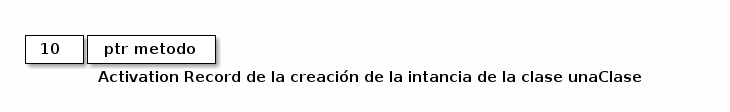
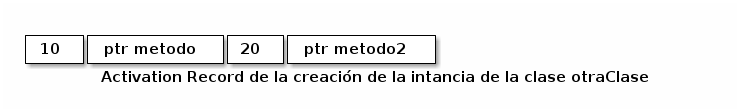
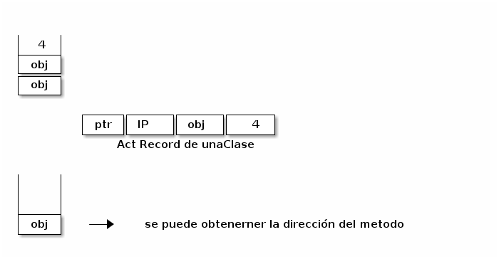
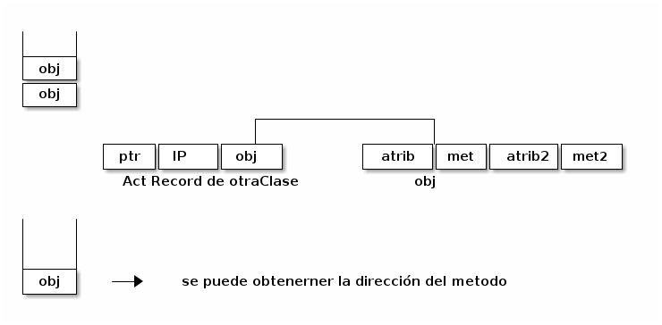
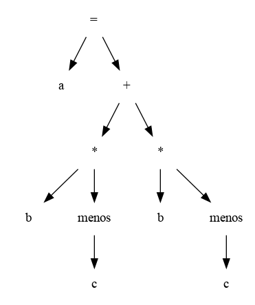

-   Compilación de Vectores

| Código               | Compilación                |
|-------------------- |-------------------------- |
| [Exp1,&#x2026;,Exp2] | <Código para evaluar exp1> |
|                      | &#x2026;.                  |
|                      | <Código para evaluar expn> |
|                      | OpMakeArray                |
| exp1[exp2]          | <Código para evaluar exp1> |
|                      | <Código para evaluar exp2> |
|                      | OpArrayDesRef              |
| exp1[exp2]=exp3      | <Código para evaluar exp1> |
|                      | <Código para evaluar exp2> |
|                      | <Código para evaluar exp3> |
|                      | OpArrayAsign               |
|                      |                            |

Si se toma una clase java compilada, un .class y se ejecuta el comando javap -c se pueden ver los byte codes de la JVM :

```C

Code:
      0: aload_1
      1: aload_0
      2: if_acmpne     7
      5: iconst_1
      6: ireturn
      7: aload_1
      8: instanceof    #10     // class com/example/holamundo/controller/dto/UsuarioDTO
     11: ifne          16
     14: iconst_0
     15: ireturn
     16: aload_1
     17: checkcast     #10     // class com/example/holamundo/controller/dto/UsuarioDTO

```


### Lenguajes Orientados a Objetos

Cuando se compilan lenguajes orientados a objetos a clases y sistemas de tipos estáticos se suelen utilizar tablas de métodos virtuales.

Ejemplo:

```java
class unaClase{
    int atributo;
    void metodo(int x){};   
}
```


| Código                  | Acciones del Compilador Recursivo |
|----------------------- |--------------------------------- |
| new Clase (atributo=10) | OpPush 10                        |
|                         | OpPushAddr       .label-start-metodo |
|                         | OpMakeActRec 2                    |
|                         |                                   |




Todas las instancias de de unaClase son un vector de un entero y un puntero a una función


Dada otra clase que extiende a la clase anterior:

```java
class otraClase extends unaClase{
    int atributo2;
    void metodo2(){};   
}
```

la generación de código quedaria de la siguiente forma:

| Código                   | Acciones del Compilador recursivo |
|------------------------- |--------------------------------- |
| new otraClase(x=10,y=20) | OpPush  10                        |
|                          | OpPushAddr .label-start-metodo   |
|                          | OpPush  20                        |
|                          | OpPushAddr .label-start-metodo2  |
|                          | OpMakeActRec 4                    |
|                          |                                   |



Cabe destacar que una instancia de otraClase puede verse como como una instancia de unaClase extendida con más atributos y métodos.


-   Invocación a un método

| código         | Acciones del compilador Recursivo |                                          |
| -------------- | --------------------------------- | ---------------------------------------- |
| obj.metodo(4); | Código para evaluar obj        |                                          |
|                | OpDup                             | Duplica el tope de la pila               |
|                | OpPush 4                          |                                          |
|                | OpMakeActRec 2                    |                                          |
|                | OpPush 2                          | offset en el Reg Act del addr de f()     |
|                | OpVectDeref                       |                                          |
|                | OpJumpDynamic                     | salta a la dirección del tope de la pila |
|                |                                   |                                          |

OpDup : duplica el tope de la pila



Otra llamada:

| Código         | Acciones del Compilador Recursivo |
| -------------- | --------------------------------- |
| obj.metodo2(); | Código para obtener obj         |
|                | OpDup                             |
|                | OpMakeActRecord 1                 |
|                | OpPush 4                          |
|                | OpVectDeref                       |
|                | OpJumpDynamic                     |
|                |                                   |




-   Binding Dinámico: obj.metodo() esta llamada funcion para las instancias de ambas clases.

-   Self: se pasa siempre como primer parámetro de todos los métodos, ya que está en el registro de activación.


### Código de Tres Direcciones

-   Es una representación de código intermedio basada en un conjunto de instrucciones que operan con variables temporales que representan direcciones de memoria o registros.

-   La instrucción básica del código de tres direcciones está diseñada para representar la evaluación de expresiones aritméticas y tiene la siguiente forma general:

​                             x = y op z

-   Su nombre proviene de esta forma de dirección, ya que generalmente **x**, **y** y **z** representan una dirección de memoria.

-   Dado el siguiente ejenmplo:

​                2 \* a + ( b - 3)

se obtiene el siguiente AST:



Se genera el código de tres direcciones:

```C
t1= 2 * a
t2= b - 3
t3= t1 + t2
```

-   Este tipo de **Representación Intermedia** requiere que el compilador genere nombres para elementos temporales, t1, t2, t3.

-   Estos elementos corresponden na los nodos intermedios del AST y representan sus valores calculados.

-   La manera por el cual estos elementos son asignados a la memoria no se especifica por este código; normalmente se asignan a registros o también a registros de activación.

-   El código de tres direcciones generado anteriormente se ha obtenido recorriendo el árbol de izquierda a derecha, pero también puede ser generado de derecha a izquierda, con un significado diferente para los elementos temporales:

```C
t1 = b - 3
t2 = 2 * a
t3 = t2 + t1
```

-   El código de tres direcciones se basa en dos conceptos: direcciones e instrucciones. Una dirección puede ser una de las siguientes opciones:
    -   **Un nombre**: por conveniencia, se permite que los nombres de los programas aparezcan como direcciones en código de tres direcciones. En una implementación un nombre se sustituye por un puntero a una entrada en la tabla de símbolos donde se mantiene la información sobre ese nombre.
    
    -   **Una constante**.
    
    -   **Un valor temporal generado por el compilador**: es conveniente, crear un nombre distinto cada vez que se necesita un valor temporal.

### Tipos de instrucciones:

-   Etiquetas simbólicas: Son para uso de las estructuras que alteran el flujo de control.

-   Instrucciones de asignacion de la forma x=y op z, en donde op es una operación aritmética o lógica binaria, y x, y y z son direcciones.

-   Asignaciones de la forma **x=op y**, donde op es una operación unaria. Por ejemplo la negación lógica, operadores de desplazamiento y operadores de conversión.

-   Instrucciones de copia de la forma **x=y**.

-   Un salto incondicional ***goto L***. La instrucción de tres direcciones con la etiqueta L es la siguiente en ser ejecutada.

-   Saltos condicionales de la forma ***if x goto L*** e ***ifFalse goto L***. Estas instrucciones ejecutan a continuación la instrucción con la etiqueta L si x es verdadera y falsa, respectivamente. En cualquier otro caso, la siguiente instrucción en ejecutarse es la instrucción de tres direcciones que sigue en la secuencia.

-   Saltos condicionales como *if x relop y goto L*.

-   Llamadas a procedimientos y los retornos se implementan mediante el uso de las siguientes instrucciones: 
    
    -   param x para los parámetros; 
    -   call p,n y y=call p,n para las llamadas a procedimientos y funciones  
    -   y return y:
    
    ​                   param x1
    
    ​                   param x2
    
    ​                  &#x2026; 
    
    ​                  param x3 
    
    ​                  call p,n
    
    
    
-   Instrucciones de input output: *read, write*

-   Instrucciones de copia indexada, de la forma x=y[i] y x[i]=y

- Asignación de direcciones y punteros de la forma:

    x=&y,

    x=\*y 

    \*x=y

Ejemplo:

```C
read x;
if 0<x then
    fact:=1;
    repeat
	 fact:= fact*x;
	 x:=x-1;
    until x=0;
    write fact;
end;
```
en código de tres direcciones:
```C
    read x 
    t1=x>0 ifFalse t1 goto L1 
    fact=1 
label L2 
    t2=fact*x 
    fact=t2 
    t3=x-1 
    x=t3 
    t4=x==0 ifFalse t4 goto L2
    write fact
label L1 
    halt 
```

### Estructura de datos para la implementación de código de tres direcciones

1. Cuádruplos:

   La descripción de las instrucciones de tres direcciones especifican los componentes de cada instrucción, pero no especifica la representación de estas instrucciones en una estructura de datos.

   

   En un compilador estas instrucciones se pueden implementar como registros (u objetos), con campos para el operador y los operados.

   

   Un **cuádruplo** tiene cuatro campos, que se denominan op, arg1, arg2, y resultado: op contiene un código interno para el operador, arg1 y arg2 contienen los argumentos y resultado el resultado de la operación. Excepciones a esta regla:

   -   instrucciones con operadores unarios, no utilizan arg2

   -   los operadores param no utilizan arg2 ni resultado

   -   los saltos condicionales e incondicionales colocan la etiqueta destino en resultado

   

   Ejemplo

    a = b \* - c + b \* - c

   Código de tres direcciones

   ```C
   t1=menos c
   t2=b*t1
   t3=menos c
   t4=b*t3
   t5=t2+t4
   a=t5
   ```

   

   |   | op    | arg1 | arg2 | resultado |
   |--- |----- |---- |---- |--------- |
   | 0 | menos | c    |      | t1        |
   | 1 | *    | b    | t1   | t2        |
   | 2 | menos | c    |      |           |
   | 3 | *    | b    | t3   | t4        |
   | 4 | +     | t2   | t4   | t5        |
   | 5 | =    | t5   |      |           |


2.Tripletas:

Un triple o tripleta, sólo tiene tres campos a los cuales se los llama op, arg1 y arg2. Al usar tripletas, se refiere al resultado de una operación por su posición en vez de lugar de usar un nombre temporal explícito. Los números entre paréntesis representan punteros a la estructura de las tripletas.
    
Ejemplo:
    
    ​                         a = b \* - c + b \* - c
    

    
    |   | op    | arg1 | arg2 |
    |--- |----- |---- |---- |
    | 0 | menos | c    |      |
    | 1 | \*    | b    | (0)  |
    | 2 | menos | c    |      |
    | 3 | \*    | b    | (2)  |
    | 4 | +     | (1)  | (3)  |
    | 5 | /=    | a    | (4)  |
    |   |       |      |      |
    
    -   Implementación
    
    Una posible implementación en C de los cuádruples puede ser la siguiente:
    
    ```C
    
    typedef enum{rd,gt,if_f,asn,lab,mul,sub,eq,wri,halt,...} OpKind;
    typedef enum {Empty,IntConst,String} AddrKind;
    
    typedef struct
    { 
         AddrKind kind;
         union
         { int val;
           char * name;
         } contents;
    } Address;
    
    typedef struct
    { 
       OpKind op;
       Address addr1,addr2,result; 
    } Quad;
    
    ```

3.  Traducciones a Código de Tres direcciones

    sent-if &rarr; **if** ( exp ) sent | **if** ( exp ) sent **else** sent 
    
    sent-while &rarr; **while** ( exp ) sent
    
    
    
    -   Traducción para la estructura de control if:
        
        | Código             | Traducción         |
        |------------------ |------------------ |
        | if (E) S1 else S2; | (Evaluar E a t1)   |
        |                    | ifFalse t1 goto L1 |
        |                    | (Código para S1)   |
        |                    | goto L2            |
        |                    | label L1           |
        |                    | (Código para S2) //else |
        |                    | label L2           |
        |                    | if (E) S1 else S2 |
    
    -   Traducción para la estructura de control while:
    
    | Código       | Traducción                      |
    |------------ |------------------------------- |
    | while (E) S; | label L1                       |
    |              | (código para evaluar a E en t1) |
    |              | ifFalse  t1 goto L2             |
    |              | (Código para S)                 |
    |              | goto L1                         |
    |              | label L2                        |
    |              |                                 |
    
    -   Traducción de Procedimientos y Funciones:
    
    | Código               | Traducción |
    |-------------------- |---------- |
    | int f( int x, int y) | entry f    |
    | { return x+y+1;}     | t1=x+y     |
    |                      | t2=t1+1    |
    |                      | return t2  |
    |                      |            |
    
    -   Traducción de Llamadas a Funcines:
        
        | Código   | Traducción  |
        |-------- |----------- |
        | f(2+3,4) | begin\_args |
        |          | t1=2+3      |
        |          | arg t1      |
        |          | arg 4       |
        |          | call f      |
        |          |             |
    
    -   Referencia para arreglos
    
    ```C
    int a[SIZE]; int i,j;
    ```
    
    
    
    | Código           | Traducción |
    |---------------- |---------- |
    | a[i+1]=a[j\*2]+3 | t1=j\*2    |
    |                  | t2=a[t1]   |
    |                  | t3=t2+3    |
    |                  | t4=1+i     |
    |                  | a[t4]=t3  |
    |                  |            |
    
    
    
    | Código   | Traducción            |
    |-------- |--------------------- |
    | t2=a[t1] | t3=t1\*elem\_size(a)  |
    |          | t4= &a + t3           |
    |          | t2= \*t4              |
    | a[t2]=t1 | t3= t2\*elem\_size(a) |
    |          | t4= &a+t3             |
    |          | \*t4=t1               |
    |          |                       |
    
    -   Traducción de Registros
    
    ```C
    typdef struct rec{
       int i;
       char c;
       int  j;
    } Rec
    
    Rec x;
    ```
    
    
    
    | Código  | Traducción                 |
    |------- |-------------------------- |
    | x.j=x.i | t1=&x + field\_offset(x,j) |
    |         | t2=&x + field\_offset(x,i) |
    |         | \*t1=\*t2                  |
    |         |                            |

### Ejemplo en X86 de Borland

y esta en dx

 x esta en bx

| Código                 | Traducción        |
|---------------------- |----------------- |
| if (x>y) y++; else x--; | cmp bx,dx |
|                        | jle short @1@86 |
|                        | inc dx |
|                        | jump short @1@114 |
|                        | @1@86:            |
|                        | dec bx |
|                        | @1@114:           |
|                        |                   |
