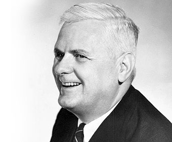

# Introducción 

## Conocimientos Previos

- Algoritmos y Programación II
- Estructura del Computador
- Teoría de Algoritmos I (deseable)

# ¿Por Qué Estudiar Compiladores?

## En Primer Lugar

> Un compilador es una fina pieza de ingeniería, en el cual cada engranaje debe funcionar con precisión superlativa. Cada uno de estos engranajes se sustenta sobre una inmensa base teórica. &#x2014;Mariano Méndez 


## En Segundo Lugar

-   Un  compilador <del>es</del> era un programa complejo y de Gran tamaño.

-   En la actualidad es un conjunto de  programas y bibliotecas que incluyen cientos de miles de líneas de código, incluso a veces millones de líneas. Están organizados en sub-sistemas que interactúan entre sí.

-   Un buen compilador contiene un microcosmos de las ciencias de la computación, utiliza:
    -  Algoritmos Greedy              &#x2014;>  Aplicación de registros
    -  Programación Dinámica     &#x2014;> Selección de instrucciones
    -  Autómatas Finitos               &#x2014;> Lexical Análisis
    -  Push Down autómatas       &#x2014;>  Parsing
    -  Alocación dinámica
    -  Sincronización
    -  Localidad
    -  Gestión de Jerarquías da Memoria

Entre otras muchísimas cosas.


## En Tercer Lugar

Además escribir un compilador simple es desde el punto de vista educativo un excelente proyecto, ya que mejora muchas habilidades para:

1.  la comprensión de los lenguajes de programación

2.  su diseño,

3.  estructura de datos

4.  diseño de algoritmos

5.  y una amplia gama de técnicas de programación.

Comprender cómo un lenguaje de alto nivel es traducido, de forma tal que puede ser ejecutado por el hardware **da** una espectacular idea de cómo el programa se comportará cuando este esté corriendo,  de donde estará el cuello de botella en la ejecución de las instrucciones individuales de alto nivel.

-   Estudiar cómo se construyen los compiladores colaborará en convertir a uno mismo en un mejor programador.


## En Cuarto Lugar

### Uno se Convierte en un Mejor Programador:

Un **craftman** tiene que comprender sus herramientas, y un programador no esta exento de esto. Mediante una mejor comprensión de como un compilador traduce un programa en código máquina uno se adquiere más habilidades en la escritura de código efectivo y sabe como debuguearlo cuando este falla.


### Uno Puede Crear Herramientas:

Si uno es capaz de crear un Parser para un lenguaje dado, esto le permite crear herramientas que proporcionan una mejor comprensión y análisis del código fuente de un programa. Además se podrá escribir herramientas como los IDE (Integrated Development Tools) que permiten ampliar las capacidades de un simple editor de texto agregando resaltado de sintaxis, refactorizaciones, métricas sobre el código escrito, entre otras muchas cosas.


### Crear Nuevos Lenguajes de Programación:

Increíblemente es posible obtener soluciones a problemas complejos, compactando estos en un determinado lenguaje ad-Hoc, este tipo de lenguaje se denomina **Domain Specific Languages** 

-   El caso de DOT, lenguaje para describir grafos

```    
    digraph graphname {   
       yellow -> orange -> red;  
       orange -> green; 
    }
```


### Contribuir con los Compiladores Existentes:

Es poco probable que uno escriba el próximo mejor compilador de C o Rust, pero estos desarrollos se encuentran en continuo cambio y actualización (GCC, Rust, Elixir,Python, por nombrar algunos). 

Todos ellos son un microcosmos en continuo cambio que necesitan:

-   el agregado de nuevas características del lenguaje,

-   portarlos a nuevas arquitecturas,

-   mejorar las optimizaciones que se hacen a los programas

Todas estas razones necesitan que los compiladores sean continuamente mejorados.


## Un Poco de Historia

## La década de los 30 

El origen de los modelos abstractos de la computación nacen justamente en esta década. Existen tres **modelos computables** equivalentes que fueron propuestos en el mismo año, 1937. 

### Kurt Godel


Matemático Austriaco    

#### Teorema de Incompletitud

 - A principios de siglo se sostenía que la lógica era un sólido soporte para las verdades matemáticas (Bertran Rsusell, _Principia mathematica_). 
   - Proposiciones Verdaderas ```A=[ 2+3 =5 ]```
   - Proposiciones Falsas ```B= [ 2*3 = ]```
   - Proposiciones Indecibles 

 - Tomó una proposición *solo sé que no sé nada* y demostró que no podía probarse que fuera cierta (porque sino habría una contradicción), pero tampoco que fuera falsa, por la misma razón. 
 
 - Godel logró demostrar que dentro de cualquier sistema matemático estrictamente lógico, siempre habría proposiciones cuya veracidad o falsedad no podría ser demostrada, partiendo de los axiomas en los que se basara ese sistema.

- Caracteriza a los sistemas incompletos como aquellos en los que no se puede evaluar si sus proposiciones son verdaderas o falsas.

#### Funciones Recursivas Parciales

#### Teoría de las Funciones Recursivas Generales


### Alan Turing

 

Matemático Inglés

#### Máquina de Turing .

- En esa misma época se pretendía averiguar si era posible o no construir algún ingenio mecánico, con el que se pudiera averiguar o demostrar en un modo automático, la veracidad o falsedad de alguna demostración de índole matemático.


- Maquina-a y maquina-u (https://turingmachine.io/)

- En la actualidad no hay ningún algoritmo que permita determinar las propiedades de los número naturales

#### Problema de la Parada

El problema de la parada o problema de la detención para máquinas de Turing consiste en lo siguiente: dada una Máquina de Turing  M y una palabra w, determinar si M  terminará en un número finito de pasos cuando es ejecutada usando w como dato de entrada. Alan Turing, en su famoso artículo **On Computable Numbers, with an Application to the Entscheidungsproblem** (1936), demostró que el problema de la parada de la Máquina de Turing es indecible (no computable o no recursivo), en el sentido de que ninguna máquina de Turing lo puede resolver. 

### Alonzo Church

 

#### Cálculo Lambda  ()

El cálculo lambda es un sistema formal diseñado para investigar la definición de función, la noción de aplicación de funciones y la recursión.  Church usó el cálculo lambda en 1936 para resolver el Entscheidungsproblem. Puede ser usado para definir de manera limpia y precisa qué es una "función computable". 

- La función identidad I(x) = x, que toma un único argumento, x, e inmediatamente devuelve x. 
- Por otro lado, la función suma S(x,y) = x + y, que toma dos argumentos, x e y, y devuelve la suma de ambos: x + y. 

- Las funciones no necesitan ser explícitamente nombradas. Esto es, la función S(x,y) = x + y puede ser reescrita como una función anónima: x,y → x + y (que se lee: «el par de x e y se mapea a x + y»). 

- Del mismo modo, I(x) = x puede ser reescrita de forma anónima como x → x, que se lee: «el argumento x se mapea a sí mismo».

- El nombre que se asigne a los argumentos de la función es generalmente irrelevante. Esto es, x → x e y → y expresan la misma función: la función identidad. Del mismo modo, x,y → x + y y u,v → u + v expresan la misma función: la función suma.

- Toda función que requiere dos argumentos, como por ejemplo la función suma, puede ser reescrita como una función que acepta un único argumento, pero que devuelve otra función, la cual a su vez acepta un único argumento. 
  - Por ejemplo, x,y → x + y puede ser reescrita como x → (y → x + y). Esta transformación se conoce como currificación, y puede generalizarse para funciones que aceptan cualquier número de argumentos. Esto puede parecer difícil de entender, pero se entiende mejor mediante un ejemplo. Considérese la función suma no currificada:

    x,y → x + y

    Al tomar a los números 2 y 3 como argumentos, se obtiene:

        2 + 3

    Lo cual es igual a 5. Considérese ahora la versión currificada de la función:

        x → (y → x + y)

    Si se toma al número 2 como argumento, se obtiene la función:

        y → 2 + y

    Y tomando luego al número 3 como argumento, se obtiene:

    2 + 3

# Los tes modelos son equivalentes, vale decir que todos describen en concepto de computabilidad desde distintas torres axiomática.


### La década de los 40

1.  Hacia los años 40 con el advenimiento de la primera computadora con programa almacenado, de la mano de John Von Neumann, hizo necesario escribir secuencias de código o programas en **lenguaje de máquina**.

```
    C7 06 0000 0002
```

1.  Así para mover un valor literal 2 a una dirección de memoria se debía escribir la secuencia anterior de comandos, esto hacia imposible que se pudieran escribir programas rápidamente y de forma poco tediosa. Por ello nace el llamado **lenguaje ensamblador** , en el cual los códigos de instrucción se reemplazaron por 3 letras que representa una instrucción mnemotécnica y por direcciones de memoria que podían se dadas en forma simbólica.

```
    MOV X,2
```


3.  Lo que se buscaba era poder mejorar aun todas esas mejoras que el lenguaje ensamblador había introducido, de manera de simplificar aun más la escritura de programas

```
    X=2
```

4.  Entre 1954 y 1954 John Backus desarrollo el primer lenguaje de programación de alto nivel, FORTRAN I y su compilador.


## El Aporte de Noam Chomsky

-   Al mismo tiempo Noam Chomsky, lingüista estadounidense que aun vive, Comenzó a estudiar la estructura del **lenguaje natural**. Sus descubrimientos hicieron que la construcción de compiladores se volviera mucho más fácil e incluso pudiera ser automatizada en cierto grado.

-   Sus estudios desembocaron en una clasificación de los lenguajes de acuerdo con la complejidad de sus **gramáticas** y la potencia de los algoritmos necesarios para reconocerlas.
    
    


## La Jerarquía de Chomsky

-   Se compone de 4 niveles gramaticales:
    
    1.  Gramáticas de Tipo 3: 
   
    - **Gramáticas Regulares**: Estos lenguajes son aquellos que pueden ser aceptados por un autómata finito. También esta familia de lenguajes pueden ser obtenidas por medio de expresiones regulares. 
    
    1.  Gramáticas de Tipo 2: 
   
    - **Gramáticas Libres del Contexto**: Estos lenguajes son aquellos que pueden ser reconocidos por un autómata con pila.
    
    1.  Gramáticas de Tipo 1: 
   
    - **gramáticas sensibles al contexto**: Los lenguajes descritos por estas gramáticas son exactamente todos aquellos lenguajes reconocidos por una máquina de Turing determinista cuya cinta de memoria está acotada por un cierto número entero de veces sobre la longitud de entrada, también conocidas como **autómatas linealmente acotados**.
    
    1.  Gramáticas de Tipo 0:

    -  que incluye a todas las gramáticas formales. Estas gramáticas generan todos los lenguajes capaces de ser reconocidos por una máquina de Turing. 


    -   Las gramáticas de Tipo 2 o **Gramáticas libres de Contexto** resultaron ser las más útiles para los lenguajes de programación.

