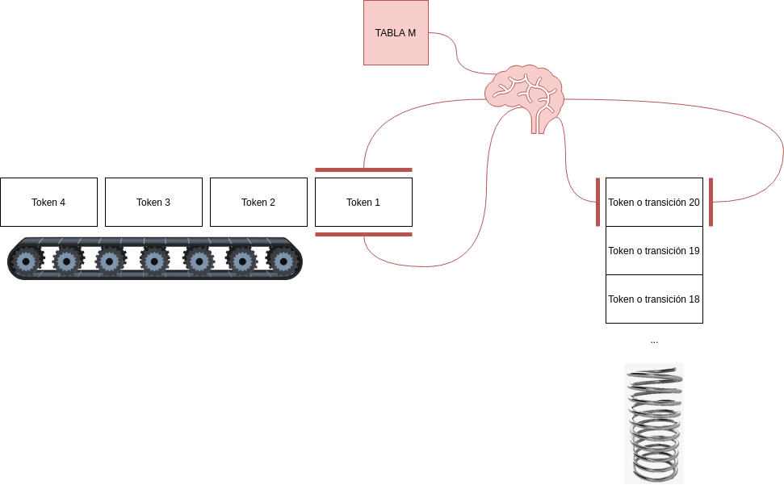

# Práctica 5 (5/10)
## Orden del día
1. Gramáticas 
2. Gramáticas LL1
3. Ejercicio interactivo gramáticas LL1
4. Parser LL1
5. Ejercicio interactivo parsing LL1
6. Intervalo 10m
7. Explicación lab 4 + criterios de corrección 

## Bibliografía
Louden 4.2, 3.2. Ullman 4.2.1. Apuntes de la teórica.

---
## Qué es una Gramática
1. Conjunto de símbolos terminales $T$ (`if`, `int`, `{` ... )
2. Conjunto de símbolos **no** terminales $V$ (`IfStmt`, `VarDecl`, `BlockExpr`)
3. Conjunto de producciones $P$ (`BlockExpr -> { CompoundStmt }`)
4. Un símbolo inicial $S$

Gramática: $G=(V,T,P,S)$

T = tokens ;)

Referencia tokens no terminales de C: [aquí](https://clang.llvm.org/doxygen/group__CINDEX.html#gaaccc432245b4cd9f2d470913f9ef0013)

---

## Cómo escribimos una gramática

1. `<simbolo_no_terminal>`
2. `symbolo_terminal`
3. Producción `<un_no_terminal> ::= los <simbolos> generados <de_este> lado`

Derivación = aplicar producciones sucesivamente.

---

## Gramática de Familang
```
<p> ::= <p> hijo_de <p>
<p> ::= <p> hermano_de <p>
<p> ::= nombre
```
- `Bart hijo_de Homero`
- `Bart hijo_de Homero hermano_de Lisa`
- `Morty hijo_de Beth hijo_de Rick`

---
<!-- class: ejemplo -->

### Ejemplo 1
`Bart hijo_de Homero hermano_de Lisa`


|estado|producción|¿cuál?|
|-|-|-|
|`<p>`|`<p> ::= <p> hijo_de <p>`|1|
|`<p> hijo_de <p>`|`<p> ::= <p> hermano_de <p>`|2|
|`<p> hijo_de <p> hermano_de <p>`|`<p> ::= nombre`|1|
|`nombre hijo_de nombre hermano_de <p>`|`<p> ::= nombre`|1|
|`nombre hijo_de nombre hermano_de nombre`|`<p> ::= nombre`|1|


---
<!-- class: ejemplo -->


### Ejemplo 2
`Bart hijo_de Homero hermano_de Lisa`


|estado|producción|¿cuál?|
|-|-|-|
|`<p>`|`<p> ::= <p> hermano_de <p>`|1|
|`<p> hermano_de <p>`|`<p> ::= <p> hijo_de <p>`|1|
|`<p> hijo_de <p> hermano_de <p>`|`<p> ::= nombre`|1|
|`nombre hijo_de nombre hermano_de <p>`|`<p> ::= nombre`|1|
|`nombre hijo_de nombre hermano_de nombre`|`<p> ::= nombre`|1|


---
<!-- class: small_code -->

## Gramáticas LL1
- No recursivas por izquierda
- No ambígua


familang original:

```
<p> ::= <p> hijo_de <p>
<p> ::= <p> hermano_de <p>
<p> ::= nombre
```

no ambígua:
```
<p> ::= nombre hijo_de <p>
<p> ::= <p> hermano_de nombre
<p> ::= nombre
```

LL1 (no recursiva por izquierda):
```
<p> ::= nombre <p0>
<p0> ::= 
<p0> ::= hijo_de <p> 
<p0> ::= hermano_de <p>
```

---

## Ejercicio interactivo familang v2
```
1. <p> ::= : nombre <p0> y_de <p>
2. <p> ::= nombre <p0>
3. <p0> ::= 
4. <p0> ::= hijo_de <p> 
5. <p0> ::= hermano_de <p>
```

1. Ejemplo: `Maggie hermano_de : Lisa hijo_de : Homero y_de Marge y_de Bart hermano_de Maggie`
1. `Maggie hermano_de Lisa hermano_de Bart hijo_de: Homero hijo_de Abraham y_de Marge hermano_de Patty`
1. `Maggie hijo_de : Homero hijo de Abraham y_de Marge hermano_de : Patty y_de Selma`
1. `Luke hermano_de : Alex y_de Haley hijo_de : Phil hijo_de Frank y_de Claire hermano_de Mitchell hijo_de : Dede y_de Jay`

---

## ¿Qué es un parser LL1? (1/3)

Es un parser descendiente recursivo que **usa un stack explícito**.

- Funciones -> derivaciones

Estructuras de datos:

- Cola de tokens ( ya la teníamos )
- callstack -> Stack de estado
- `if` o `switch` -> Tabla _M_ $M \in V \times T \rightarrow P$

---

## ¿Qué es un parser LL1? (2/3)

```python
stack_estado=[símbolo_inicial]
cola=listado_de_tokens
while len(cola) > 0:
    if cola[0]==stack_estado[0]:
        cola.pop()
        stack_estado.pop()
    else:
        produccion = M[stack_estado[0],cola[0]]
        stack_estado.push(*produccion.lado_derecho)
```

---
<!-- 
    backgroundImage: "./algoritmo.drawio.png" 
    backgroundPosition: right
    -->

## ¿Qué es un parser LL1? (3/3)



```python
stack_estado=[símbolo_inicial]
cola=listado_de_tokens
def match():
    cola.pop()
    stack_estado.pop()
def apply(produccion):
    stack_estado.push(*produccion.lado_derecho)


while len(cola) > 0:
    if cola[0]==stack_estado[0]:
        match()
    else:
        apply(M[stack_estado[0],cola[0]])
```

---

## Ejercicio interactivo de **parsing** familang v2
```
1. <p> ::= : nombre <p0> y_de <p>
2. <p> ::= nombre <p0>
3. <p0> ::= 
4. <p0> ::= hijo_de <p> 
5. <p0> ::= hermano_de <p>
```

1. Ejemplo: `Maggie hermano_de : Lisa hijo_de : Homero y_de Marge y_de Bart hermano_de Maggie`
1. `Maggie hermano_de Lisa hermano_de Bart hijo_de: Homero hijo_de Abraham y_de Marge hermano_de Patty`
1. `Maggie hijo_de : Homero hijo de Abraham y_de Marge hermano_de : Patty y_de Selma`
1. `Luke hermano_de : Alex y_de Haley hijo_de : Phil hijo_de Frank y_de Claire hermano_de Mitchell hijo_de : Dede y_de Jay`

---

## Intervalo `termdown 10m`

---
## Explicación Lab 4 + criterios de corrección
1. Aceptar el assignment (link ahora o en el mail luego)
2. Clonar el assignment YAYAYA
3. Puntaje (hasta 11! punto extra):
    - Entrega (Pasan los test): **7 puntos**
    - Terminan el lab **entero** antes de las 22: **+1ptos** 
    - El último commit es previo al martes 18/10 23:59: **+3ptos**