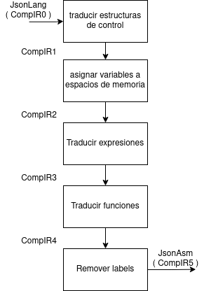

# Práctica 8 (26/10)
**Orden del día:**

1. Explicación lab 6 + criterios de corrección
1. Repaso de JsonLang/CompIR0
1. Presentación de JsonAsm/CompIR5
3. Comparación CompIR0 vs CompIR5
4. Arquitectura propuesta
4. CompIR0 a CompIR1: Traducir estructuras de control
4. CompIR1 a CompIR2: Eliminar variables y scopes
4. CompIR2 a CompIR3: Eliminar expresiones
4. CompIR3 a CompIR4: Eliminar funciones
4. CompIR4 a CompIR5: Eliminar labels


**Bibliografía:** esta vez no hay

---


## Explicación Lab 6 + criterios de corrección
1. Aceptar el assignment (link ahora o en el mail luego)
2. Clonar el assignment si quieren
3. Puntaje (hasta 11! punto extra):
    - Entrega (Pasan los test): **6 puntos**
    - 5 ó más tests que contienen la palabra "extra" en la descripción: **+2 puntos**
    - El último commit del PR tiene fecha previa al 8/11 23:59: **+1 puntos**
    - El último commit del PR tiene fecha previa al 15/11 23:59: **+2 puntos**

---

## Repaso de JsonLang
```ts
export type TopStatement<Expr> = 
/* estructuras de control */
| {
  if: { cond: Expr; then: Statement<Expr> }[];
  else?: Statement<Expr>;
}
| { while: Expr; do: Statement<Expr> }
| Statement<Expr>[]
| { iterator: string; from: Expr; to: Expr; step?: Expr; do: Statement<Expr> }
| { do: Statement<Expr>; until: Expr }
| "break"
| "continue"

/* variables con scopes */
| { declare: string; value: Expr }
| { set: string; value: Expr }

/* funciones/procedimientos */
| { call: string; args: Expr[] }
| { return: Expr }
| {
  function: string;
  args: string[];
  block: Stmt;
}
```

---

## Presentación de JsonAsm
```ts
export type Statement =
/* manejo de stack */
  | { push: Memdir | { literal: number }|"pc" }
  | { pop: Memdir | "pc" }
/* branches, jumps */
  | { bz: Offset }
  | { bnz: Offset }
  | { jmp: Offset }
/* aritmética */
  | Binops
  | Unops;

type Offset = number;
type Memdir = number;
type Binops = "+" | "-" | "*" | "/" | "<=" | ">" | "==" | "and" | "or" /* etc */;
type Unops = "neg" | "!" | "~";
```

---

## Comparación CompIR0 vs CompIR5

| categoría               | CompIR0/JsonAsm     | CompIR5/JsonLang               |
| ----------------------- | ------------------- | ------------------------------ |
| control de flujo        | if, while, iterator | jmp, bnz, bz                   |
| modelo de memoria       | variables           | memoria indexada               |
| operaciones aritméticas | expresiones         | operaciones sobre el stack     |
| soporte de subprogramas | funciones           | stack, operaciones sobre el PC |

---

## Arquitectura propuesta


---

## CompIR0 a CompIR1: Traducir estructuras de control
- Recorrido recursivo del AST (recursividad estructural)
- Agregar **labels**, branches condicionales  y **`push`** de expresiones para replicar la semántica de las estructuras de control
- Ver ejemplo while, if en starter
- **Llegan:** `lbl` , `push`, `bnz`, `bz`, `jmp`, `functionIntro`, `functionEnd`, `enterBlock`, `exitBlock`
- **Se van:** `if else`, `while do`, `iterator do`, `do until`, `break`, `continue`
- **Flashback:** `GeneralExecutor`

---

## CompIR1 a CompIR2: Eliminar variables
- Mapeo.
- **Flashback:** clase `Context`. 
    - `functionIntro`, `enterBlock`, etc. Invocan métodos de `Context`. 
    - En vez de un diccionario de valores tiene un diccionario de IDs
- **Se van:** todas las variables, `functionIntro`, `functionEnd`, `enterBlock`, `exitBlock`, `declare`

---

## CompIR2 a CompIR3: Eliminar expresiones
- **Mapeo** (`flatMap`) de comandos, **recursion** dentro de las expresiones.
- Calculadora postfija. `1 + 2` se traduce a `[{push: 1},{push:2},"+"]`
- En el caso de las invocaciones a funciones se debe agregar `callBegin` antes de pushear los argumentos.
- **Se van:** `push`, `set`, `call`
- **Llegan:** `callStart`, `callEnd`

---

## CompIR3 a CompIR4: Eliminar funciones
- `return` se convierte en `{pop:"pc"}`. Pero qué pongo en `pc`?
- El caller debe mandar el PC, sin perder su propio PC de retorno.
- Mi solución (es mejorable) (cada subprograma almacena su PC de retorno en `-3`). Efecto sobre el stack de cada instrucción:
    - `callBegin`: `[]` -> `[callerRetAddr]`. (`callerRetAddr` está en `-3` siempre)
    - `callEnd`: `[callerRetAddr,arg1,arg2,arg3]` -> `[retval]`
    - `functionIntro`: `[callerRetAddr,arg1,arg2,arg3,calledRetAddr]` -> `[callerRetAddr]`
    - `return`: `[callerRetAddr,retVal]` -> `[callerRetAddr,retVal]`. hace `{pop:"pc"}` de **su** dirección de retorno + 2.
- Pueden hacer casi todo el lab sin esta parte. Es conveniente que piensen de forma genérica en qué efecto tiene cada instrucción.

---

## CompIR4 a CompIR5: Eliminar labels
- **Se van:** `lbl`
- Algoritmo:
  1. Primera pasada: Crear un mapa de posiciones absolutas de cada label
  2. Segunda pasada: Reemplazar los labels por offsets
---

## Orden recomendado de trabajo
1. Completar CompIR4Translator.ts con la implementación correcta, utilizando el unit test provisto.
2. Completar CompIR3Translator.ts con "no-ops". Hay pocos ejemplos con funciones!
3. Construir algunos (pocos!) unit tests para CompIR2Translator.ts
4. Implementar CompIR2Translator.ts a partir de esos unit tests
5. Implementación de CompIR1Translator.ts que ignore funciones y bloques.
6. Workflow: Ejecutar los unittests, iterar ajustes de forma que pasen cada vez más tests.