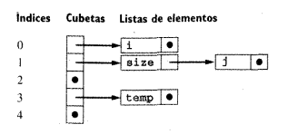

## Análisis Semántico

-   El **análisis semántico** es la fase en la cual el compilador calcula la información adicional necesaria para la compilación una vez que se conoce la estructura sintáctica de un programa.

-   Esta fase se conoce como **análisis semántico** debido a que involucra el calculo de información que sobrepasa las capacidades de las gramáticas libres de contexto y los algoritmos de análisis sintáctico estándar, por lo que no se considera sintaxis.

-   La información calculada también esta estrechamente relacionada con el significado final, o semántica, del programa que se traduce.

-   Como el análisis que realiza el compilador es estático por definición, el análisis semántico también se conoce como **análisis semántico estático**.
    -   En un lenguaje típico estáticamente tipado como C, en análisis semántico involucra la construcción de una tabla de símbolos para mantenerse al tanto de los significados de los nombres establecidos en las declaraciones, inferir los tipos y verificarlos en las expresiones y sentencias con el fin de determinar la exactitud dentro de las reglas de tipos del lenguaje.

El análisis semántico se divide en dos categorías:

-   La primera es el análisis de un programa que requiere las reglas del lenguaje de programación para establecer su exactitud y garantizar una ejecución adecuada. La complejidad de este tipo de análisis varia según lo requerido por la definición del lenguaje. En lenguajes orientados en forma dinámica tales como LISP y SMALLTALK pueden no haber análisis semántico estático mientras que en lenguajes como ADA existen fuertes requerimientos que debe cumplir un programa para ser ejecutable.
-   La segunda categoría de análisis semántico es el análisis realizado por un compilador para mejorar la eficiencia de ejecución del programa traducido. Esta clase de análisis, por lo regular, se incluye en análisis de optimización o técnicas de mejoramiento de código. El análisis semántico a diferencia del análisis léxico y del análisis sintáctico no posee generadores automáticos de analizadores semánticos, como el caso de lex o yacc.
-   En el análisis sintáctico existen tres componentes importantes
    -   La tabla de símbolos
    
    -   La verificación y control de tipos
    
    -   Las gramáticas con atributos

Estas últimas son más útiles para los lenguajes que obedecen el principio de la **semántica dirigida por sintaxis**, la cual asegura que el contenido semántico de un programa se encuentra estrechamente relacionado con su sintaxis. Todos los lenguajes modernos tienen esta propiedad.

-   Normalmente quien escribe un compilador casi siempre debe construir una gramática con atributos a mano a partir del manual del lenguaje, ya que rara vez la da el diseñador del lenguaje.

-   Los algoritmos para la implementación del análisis semántico tampoco son tan claramente expresables como los algoritmos de análisis sintáctico.

-   Existe un problema adicional causado por la temporalidad del análisis durante el proceso de compilación. Si el análisis semántico se puede suspender hasta que todo el análisis sintáctico este completo, entonces la tarea de implementar el análisis semántico se vuelve considerablemente más fácil. Y consiste en esencia en la especificación de orden para el recorrido del árbol sintáctico, junto con los cálculos a realizar cada vez que se encuentra un nodo en el recorrido. Sin embargo, esto implica que el compilador debe realizar varias pasadas de análisis. Si por otra parte el compilador necesita realizar todas sus operaciones (incluyendo la generación de código en un solo paso), entonces la implementación del análisis semántico se convierte en mucho mas que un proceso a propósito para encontrar un orden correcto y un método para calcula la información semántica. En la actualidad los escritores de compiladores utilizan varias pasadas para simplificar los procesos de análisis semántico y generación de código.


### La Tabla de Símbolos

La tabla de símbolos es el principal atributo heredado en un compilador, y, después del árbol sintáctico, también forma la principal estructura de datos. Si bien la tabla de símbolos esta estrechamente relacionada con el análisis sintáctico y el análisis léxico, los cuales pueden consultarla para resolver ambigüedades.

Pero sin embargo, en ciertos lenguajes como Ada y PASCAL, es posible e incluso razonable posponer las operaciones de la tabla de símbolos hasta después de realizar en análisis sintáctico completo, es decir cuando se sabe que el programa que se esta traduciendo es sintácticamente correcto.

-   Principales operaciones en la tabla de símbolos:
    -   Inserción: Se utiliza para almacenar la información proporcionada por las declaraciones de nombre cuando se procesan estas declaraciones.

```C
insert(name, record);
```

-   Búsqueda: Es necesaria para recuperar la información asociada con un nombre cuando éste se utiliza en el código.

```C
look_up(name);
```

-   Eliminación: Es necesaria para eliminar la información proporcionada por una declaración cuando ya no se aplica.

La propiedades de estas operaciones son dictadas por las reglas del lenguaje de programación que se esta traduciendo. En particular la información que se necesita almacenar en la tabla de símbolos está en función de la estructura y propósito de las declaraciones.

La información que incluye puede ser:

-   Tipo de Dato
-   Lexema
-   Posición
-   Ámbito (scope): información de la aplicabilidad.
-   Información acerca de la ubicación posible en la memoria.

1.  Estructura de la Tabla de Símbolos

    La Tabla de Símbolos en un compilador es una estructura de datos llamada **diccionario o tabla de hash**, obviamente por sus bondades en los tiempos de acceso a los datos. Las operaciones sobre la tabla de Símbolos deben ser lo más eficientes posible.
    
    Normalmente se utiliza un **diccionario con resolución de colisiones de tipo abierto**:
    
    
    
    Obviamente en este punto se debe tener en cuenta todo lo que se conoce sobre la implementación de diccionarios o tablas de hash: correcta elección de la función de hash, la longitud inicial del diccionario, etc. Todo ese análisis debiera realizarse con los conocimientos sobre la estructura de dato en cuestión.

2.  Declaraciones

    El comportamiento de la tabla de símbolos depende mucho de las propiedades de las declaraciones del lenguaje que se está traduciendo. ¿Que se inserta?
    
    Existen cuatro clases básicas de declaraciones:
    
    -   Declaraciones de Constantes
        
        ```C
        const int SIZE = 199;
        ```
    
    -   Declaraciones de Tipos
    
    ```C
    struct Entry
      {
          char * name;
          int count;
          struct Entry * next;
      }
      typedef struct Entry * Entry_ptr;
    
    ```
    
    -   Declaraciones de Variables
    
    ```C
    int x;
    int vector[10];
    ```
    
    -   Declaraciones de Funciones
    
    ```C
    int funcion (int x, int y);
    ```

3.  Un Ejemplo

    A continuación se muestra una posible implementación para crear una entrada en una tabla de símbolos en C:
    
    ```C
    typedef enum { SYMBOL_LOCAL, SYMBOL_PARAM, SYMBOL_GLOBAL, SYMBOL_FUNCTION, SYMBOL_CONST} symbol_t;
    
    struct symbol
    { 
      symbol_t kind;        
      struct type *type;
      char *name;
      int  which;
    };
    
    struct symbol * symbol_create(symbol_t kind, struct type * type, char * name)
    {
        struct symbol *s = malloc(sizeof(*s));
        s->kind=kind;
        s->type=type;
        s->name=name;
        return s;
    {
    
    ```
    
    -   kind: indica si un símbolo es una variable local, función, variable global, etc.
    -   type: apunta a una estructura de dato que indica el tipo de la variable.
    -   name: el nombre de la variable.
    -   which: la posición ordinal de la variable local o del parámetro en una función.


### Reglas de Ámbito y Estructura de Bloques

Las reglas de ámbito en los lenguajes de programación varían mucho, pero existen varias reglas que son comunes a muchos lenguajes.

-   **Declaración antes de uso**: Es una regla común utilizada en C y en PASCAL que requiere que se declare un nombre en el texto del programa antes que cualquier referencia al nombre. Esta declaración antes del uso permite construir la tabla de símbolos a medida que el análisis sintáctico continúa y que las búsquedas se realicen tan pronto como se encuentra una referencia de nombre en el código; si la búsqueda falla es que ha ocurrido una violación de la declaración antes del uso. Este tipo de regla fomenta compilaciones de una sola fase
-   **Estructura de bloques**: Es una propiedad común de los lenguajes modernos. Un bloque en un lenguaje de programación es cualquier construcción que pueda contener declaraciones. En C los bloques son unidades de compilación, es decir las declaraciones de procedimientos y funciones y las sentencias compuestas (encerradas entre llaves). En un lenguaje orientado a objetos la declaración de clases también son bloques. Un lenguaje esta estructurado en bloques si permite la anidación de bloques dentro de otros bloques, y si el ámbito de declaraciones en un bloque esta limitado a ese y otros bloques contenidos en el mismo, sujeto a la **regla de anidación mas próxima**: dadas varias declaraciones diferentes para el mismo nombre, la declaración que se aplica a una referencia es la única en ese bloque anidado mas próximo a la referencia.
    -   En muchos lenguajes, como PASCAL y Ada, los procedimientos y funciones también pueden estar anidados (esto presenta un factor de complicación en el ambiente de tiempo de ejecución para tales lenguajes).

```C
int i,j;

int f(int size)
   { char i, temp;
     ...
     { double j;
       ...
     } 
     ...
     { char * j;
       ...
     }
   } 
```

-   Para implementar ámbitos anidados, la operación de inserción de la tabla de símbolos no debe sobrescribir declaraciones anteriores, sino que las debe ocultar temporalmente, de manera que la operación de búsqueda solo encuentre la declaración para un nombre que se haya insertado más recientemente.

-   La operación de eliminación no debe eliminar todas las declaraciones correspondientes a un nombre, sino sólo la más reciente, revelando cualquier declaración previa.

-   Existen varias alternativas posibles para la implementación de ámbitos anidados. Una solución es construir una nueva tabla de símbolos para cada ámbito y vincular las tablas desde ámbitos internos a ámbitos externos.


-   De manera adicional o alternativa, pueden necesitarse asignar un nivel de anidación o profundidad de anidación a cada ámbito y registrar en cada entrada de la tabla de símbolos el nivel de anidación de cada nombre.


### Gramáticas con Atributos

- Es un formalismo para expresar semántica. 

  

  Dada una gramática libre de contexto se le agregan:

  -   Atributos: Estos atributos se agregan principalmente a los **nodos no terminales**

  -   Funciones o Acciones Semánticas: B &rarr; Ab {accion semántica}

-   Idea: Para cada una de las producciones de los nodos no terminales

​      P,A,B &rArr; B.atributo1                     Son arbitrarios 

​                    B.atributo2 

​                    B.atributo3


-   Las gramáticas con atributos trabajan con el árbol de parsing.
    -   Una vez que se construye el árbol de parsing.
    
    -   Se puede establecer un orden de dependencia en relación a los atributos
    
    -   Existen tres clases de atributos:
        -   **Sintetizados**: Son los atributos que en general suben desde el árbol, es decir, vienen de las hojas y van hacia la raíz.
            
            E &rarr; T               E.x=f(T,y)
            
            A &rarr; B              A.x=f(B,y)
            
            y es un atributo de T x es un atributo de E
            
            
            
        - **Heredados**: Es justo el caso inverso de esta situación.
        
          A &rarr; B            B.y=f(A,x)
        
          E &rarr; T             T.y=f(E,x)
        
          Los atributos de T están utilizando cosas que vienen de E
        
          
        
        - **Inherentes**: Son atributos fijos A &rarr; 0|1|2       A.x=0              "HARCODEADOS"
    
    Son los generadores, van a estar generando los valores de los atributos en algún punto del árbol; generan las semillas de los valores.

Los atributos y las acciones semánticas establecen una relación de flujo de información, en cuanto a que para ejecutar una acción semántica particular en algún momento particular, se necesitan atributos, y estos atributos provienen de diferentes lugares, ramas que los sinteticen o definiciones de las raíces heredadas.

Sobre el árbol de parsing se sobreimprime un árbol de dependencia dado por cómo se necesitan los atributos. Lo que hace falta hacer es cómo sincronizar ese doble esquema

Por un lado el árbol se va a parsear en el **orden** en que se van a ir determinando las derivaciones en la pila, eso depende de cómo es la gramática, el tipo de parser, etc.

Ese orden es arbitrario y viene dado por las dependencias que se establecen a través de los atributos (si son sintetizados o heredados).

Una vez que se tiene un árbol sintáctico de cómo un parser reconoce una palabra para un lenguaje, se hace un grafo que se sobrescribe por arriba del árbol de parsing y que determina una relación de dependencia, es decir, que hay que hacer primero, después, y así&#x2026; dependiendo de las reglas semánticas y lo que éstas hacen.

Ejemplo:

A &rarr; AB|B

B &rarr; 0|1

Reglas semánticas que permitan obtener el equivalente decimal del numero binario dado por el lenguaje generado por la gramática.

Sea S=101

Usar LL(1)

1.  Se construye el árbol de parsing utilizando el método LL(1)


1.  Se listan todas las producciones individual mente y se le asignan acciones y atributos:

A<sub>1</sub> &rarr; A<sub>2</sub>B                  {A<sub>1</sub>.val=A<sub>2</sub>val*2 + B.val }

$$      $1                    {$$=$1}

A &rarr; B                        {A.val=B.val } (Se esta sintetizando el valor hacia arriba)

B &rarr; 0                        {B.val=0}

B &rarr; 1                         {B.val=1}

Atributos: 

A.val 

B.val


### 
