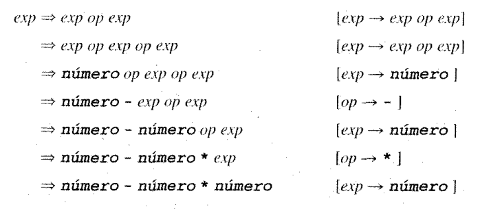

## Derivaciones
Una derivación es la aplicación de producciones una después de la otra, empezando por el símbolo *inicial* hasta alcanzar una secuencia que conforme una cadena válida del lenguaje.

Ejemplo extraído de Louden sección 3.4.1:

En la carpeta `main/.../compiladores/parte1` se encuentran los siguientes archivos:
- `deriver/Deriver.java` y `applicator/Applicator.java`: implementación de una clase que permite escribir derivaciones en Java
- `TokenType.java`: enumerado de tipos de token
- `Derivations.java`: derivaciones a completar

### Consigna
**Completar los métodos de `Derivations.java` de forma que pasen los tests de `test/.../parte1/DerivationsTest.java`.** Los métodos de `Derivations.java` deben estar conformados unicamente por llamadas a los métodos públicos de la instancia de `Deriver` pasada como arguento.

:::tip

La clase `Deriver` incluye el método `getPhrase()`, que puede ayudar a debuggear la derivación, mostrandote la cadena de tokens actual.

:::