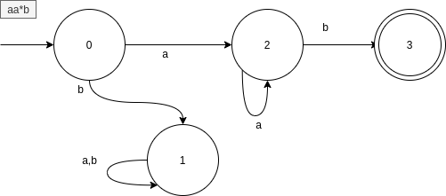
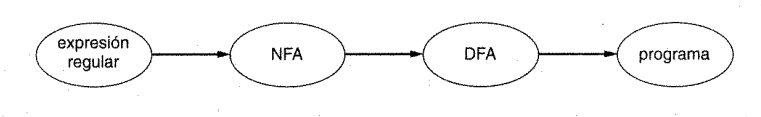
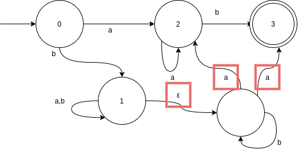
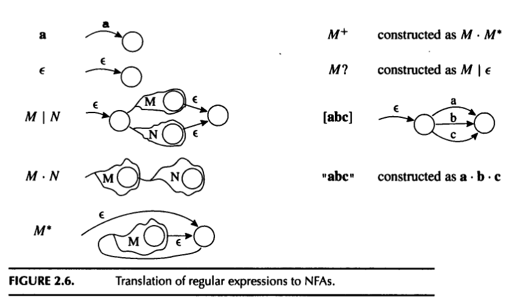
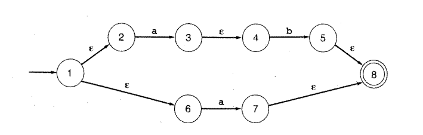
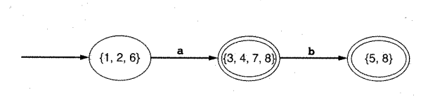
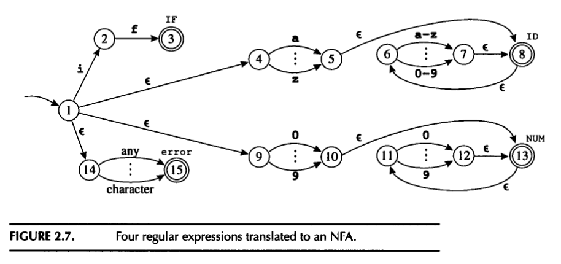

# Práctica 2 (15/9)
---
## Orden del día
1. Repaso DFA con ppt (30')
2. Ejercicios clásicos de DFA interactivos (draw.io) (15')
3. Ejemplo de autómata de un lenguaje y cómo lo hago (10')
4. Ejercicio interactivo en que diseñan el parser de un lenguaje (15')
5. Explicación de la primera parte del lab 1 (30')
6. Hacer parte 1 de forma interactiva (30')
---
## Repaso de DFA
---
### Notación

| símbolo | significado |
|-|-|
|`a`| se requiere una `a`|
|`M|N`|alternativas: se requiere `M` o `N`|
|`(MN)`|grupo: o se captura `MN` o no se captura nada|
|`MN`|Concatenación: `N` luego de `M`|
|`M*`|Clausura de Kleine: `M` Se repite 0 o más veces|
|`M+`|Repetición: `M` Se repite una o más veces|
|`M?`|Opcional: `M` Se repite 0 ó una vez|
|`.`|Se requiere cualquier caracter|
|`[abc]`|Equivalente a `a|b|c`|
|`[a-f]`|Equivalente a `[abcdef]`|

y mucho más...

---
### Autómatas finitos Determinísticos (DFA)
Un DFA se cocina con:

- Alfabeto $\Sigma$
- Conjunto de estados $D$
- Función de transición $T:D\times\Sigma\rightarrow D$
- Estado inicial $S_0 \in D$
- Estados de aceptación $A \subset D$

$(\Sigma,D,T,S_0,A)$

---

### Ejemplo

- Todo el domínio de $T$ tiene imagen.
- Nosotros además **validamos**: **1** es un _dead state_. 

---

### Cómo llegar al lexer

---
### Autómatas finitos no determinísticos (NFA)
- transiciones $\epsilon$
- transiciones repetidas

---

### De expresión regular a NFA (tiger fig 2.6)

---

### De expresión regular a NFA (ejemplo Louden 2.16)

---

## Actividad interactiva (Louden pg 95)
Para cada actividad (cada uno hace una):
1. Escribir la regex y testearla en regexr.com
2. Escribir el autómata en draw.io
3. $N$ nos comparten pantalla y nos muestran la regex y el diagrama en 15', dentro de 10'. Cada uno hace una distinta. Los demás me lo mandan a slack por DM.

---

### Ejemplo
Cadenas del alfabeto $\{a,b\}$ con un número par de $a$. 

---

### Actividades
1. strings que comienzan y finalizan en `a`
2. strings que no contienen `0` al principio
3. strings que representen números pares
4. strings que representen números donde todos los `9` aparezcan antes que todos los `9`
5. Todas las cadenas de `a` y `b` que no tengan tres `b` consecutivas
6. Todos los strings de `a` y `b` que contengan un número impar de `a` o un número impar de `b` (o ambos)
7. All strings of lowercase letters that contain the five vowels in order.
8. Comments, consisting of a string surrounded by /* and */ , without an intervening */, unless it is inside double-quotes ( " )

---

## Cómo conseguir un lenguaje

Unir regexes con $\epsilon$.

De los estados `IF`, `ID`, `NUM` debería salir un "dead state".

---

### Ejemplo: lenguaje FORTALEZA
- `(FO)+ `
- `F+`
- `FOR`
- `FORTALEZA`

---

### Ejemplo interactvo: Lenguaje SELE
- `SELECT`
- `SELENIUM`
- identificadores (pueden tener dígitos)
- números enteros

Los tokens se separan con guiones (`-`). Los espacios son ilegales.