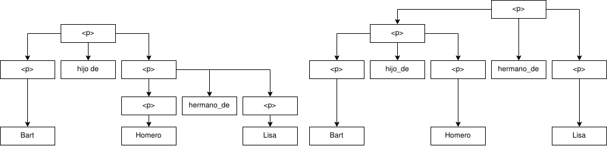
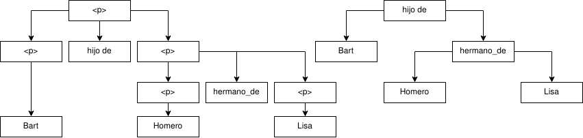

# Práctica 4 (6/10)
---
## Orden del día
---
## Qué es una Gramática
1. Conjunto de símbolos terminales $T$ (`if`, `int`, `{` ... )
2. Conjunto de símbolos **no** terminales $V$ (`IfStmt`, `VarDecl`, `BlockExpr`)
3. Conjunto de producciones $P$ (`BlockExpr -> { CompoundStmt }`)
4. Un símbolo inicial $S$

Gramática: $G=(V,T,P,S)$

Referencia tokens no terminales de C: [aquí](https://clang.llvm.org/doxygen/group__CINDEX.html#gaaccc432245b4cd9f2d470913f9ef0013)

---
## Ejemplo de Gramática de Familang
```
<p> ::= <p> hijo_de <p>
<p> ::= <p> hermano_de <p>
<p> ::= nombre
```
### Frases que cumplen la gramática:
- `Bart hijo_de Homero`
- `Bart hijo_de Homero hermano_de Lisa`
- `Morty hijo_de Beth hijo_de Rick`
---
## Derivaciones
Derivar la frase aplicando las reglas de la gramática.
Objetivo: `Morty hijo_de Beth hijo_de Rick hermano_de Summer`

|estado|producción|¿cuál?|
|-|-|-|
|`<p>`|`<p> ::= <p> hijo_de <p>`|1|
|`<p> hijo_de <p>`|`<p> ::= <p> hijo_de <p>`|2|
|`<p> hijo_de <p> hijo_de <p>`|`<p> ::= <p> hermano_de <p>`|3|
|`<p> hijo_de <p> hijo_de <p> hermano_de <p>`|`<p> ::= nombre`|1|
|`nombre hijo_de <p> hijo_de <p> hermano_de <p>`|`<p> ::= nombre`|3|
|`nombre hijo_de <p> hijo_de <p> hermano_de nombre`|`<p> ::= nombre`|2|
|`nombre hijo_de <p> hijo_de nombre hermano_de nombre`|`<p> ::= nombre`|2|
|`nombre hijo_de nombre hijo_de nombre hermano_de nombre`|`<p> ::= nombre`|1|
---
### Ejercício derivaciones
`Bart hijo_de Homero hermano_de Lisa`
Hagan la derivación, me la dictan y la escribo acá `termdown 5`

|estado|producción|¿cuál?|
|-|-|-|
|`<p>`|`<p> ::= <p> hijo_de <p>`|1|
|`<p> hijo_de <p>`|`<p> ::= <p> hermano_de <p>`|2|
|`<p> hijo_de <p> hermano_de <p>`|`<p> ::= nombre`|1|
|`nombre hijo_de nombre hermano_de <p>`|`<p> ::= nombre`|1|
|`nombre hijo_de nombre hermano_de nombre`|`<p> ::= nombre`|1|

---
### Árbol sintáctico
`Bart hijo_de Homero hermano_de Lisa`



---
### Árbol de Sintaxis Abstracto
`Bart hijo_de Homero hermano_de Lisa`



---

### Ejercício calculang
```
<expr> ::= <expr> <op> <expr>
<expr> ::= int
<op> ::= +
<op> ::= -
<op> ::= *
```

`1 - 2 + 3 * 4`

Armen los AST más tergiversadores que se les ocurran y nos lo muestran
```
termdown 5
```
---

### Derivación interactiva
Derivemos para llegar a `1 - 2 + 3 * 4`

---
### Arreglando Familang
Tenemos que modificar las reglas de forma que haya un sólo AST posible

ambígua:
```
<p> ::= <p> hijo_de <p>
<p> ::= <p> hermano_de <p>
<p> ::= nombre
```
no ambígua:
```
<p> ::= nombre hijo_de <p>
<p> ::= <p> hermano_de nombre
<p> ::= nombre
```

Ejercício: arreglar Clalculang `termdown 5`

---
## Gramática "limpia" LL(1)
recursiva por izquierda:
```
<p> ::= <p> hermano_de nombre | nombre hijo_de <p> | nombre
```
recursiva por derecha:
```
<p> ::= nombre <p0>
<p0> ::= | hijo_de <p> | hermano_de <p>
```
ó bien
```
<p> ::= nombre <p0>
<p0> ::= 
<p0> ::= hijo_de <p> 
<p0> ::= hermano_de <p>
```

---

## Derivaciones con gramáticas limpias
Derivar la frase aplicando las reglas de la gramática.
Objetivo: `Morty hijo_de Beth hijo_de Rick hermano_de Summer`
|estado|producción|¿cuál?|
|-|-|-|
|`<p>`|`<p> ::= nombre <p0>`|1|
|`nombre <p0>`|`<p0> ::= hijo_de <p> `|1|
|`nombre hijo_de <p>`|`<p> ::= nombre <p0>`|1|
|`nombre hijo_de nombre <p0>`|`<p0> ::= hermano_de <p>`|1|
|`nombre hijo_de nombre hermano_de <p>`|`<p> ::= nombre <p0>`|1|
|`nombre hijo_de nombre hermano_de nombre <p0>`|`<p0> ::= `|1|
---

## Ejercícios Wrainfuck
```
1. <expression> ::= ,<expression>
2. <expression> ::= 0
3. <expression> ::= (<expression>,<division>)
4. <expression> ::= [<division>/<division>]
5. <division>   ::= 1/<expression>
6. <division>   ::= n
```
Escriban en una hoja la secuencia de las reglas que aplican y me las cantan. Si encuentran distinto avisan. **Siempre se convierte el de la izquierda.** $S=expression$ `termdown 10`
1. Ejemplo: `,,,,([n/n],1/0)`
1. `,,,[n/n]`
1. `[1/0/n]`
1. `[1/,,,0/n]`
1. `,1/[1/(0,n)/n]`

---

## Parser LL1: apply y match
```
1. <p> ::= nombre <p0>
2. <p0> ::= 
3. <p0> ::= hijo_de <p> 
4. <p0> ::= hermano_de <p>
```
Objetivo: `Morty hijo_de Beth hijo_de Rick hermano_de Summer`

|stack|head| index| action|
|-|-|-|-|
|`$ <p>`|`Morty`| 0| apply 1|
|`$ <p0> nombre`|`Morty`|  0| match 💥 |
|`$ <p0> `|`hijo_de`| 1 | apply 3 | 
|`$ <p> hijo_de `|`hijo_de`| 1 | match 💥 |
|`$ <p> `|`Beth`| 2 | apply 1 |
|`$ <p0> nombre `|`Beth`| 2 | match 💥 |
|`$ <p0> `|`hijo_de`| 3 | apply 3 | 
|`$ <p> hijo_de `|`hijo_de`| 3 | match 💥 | 
|`$ <p> `|`Rick`| 4 | apply 1 | 
|`$ <p0> nombre  `|`Rick`| 4 | match 💥 | 
|`$ <p0>  `|`hermano_de`| 5 | apply 4 | 
|`$ <p> hermano_de `|`hermano_de`| 5 | match 💥 | 
|`$ <p> `|`Summer`| 6 | apply 1 | 
|`$ <p0> nombre `|`Summer`| 6 | match 💥 | 
|`$ <p0> `|| 7 | apply 2 | 
|`$ `|| 7 | FIN | 
---

---

## Parser LL1: Brainduck
```
1. <duck> ::= 2 <duck>
2. <duck> ::= ¡ <duck> <duck> !
3. <duck> ::= ¿ <penguin> ?
4. <duck> ::= 3
5. <penguin> ::= cuack <duck>
7. <penguin> ::= 1 
8. <penguin> ::= l <penguin> <penguin> 
```
Escriban en una hoja la secuencia de reglas aplicadas ó match. Si encuentran distinto avisan. $S=duck$ `termdown 15`
1. Ejemplo: `¿ l 1 l cuack 3 1?`
1. Ejemplo: `¿ l 1 1?`
1. Ejemplo: `¡ 2 3 3 !`
1. Ejemplo: `2 ¡ 3 ¿ 1 ? !`

---

## Explicación primera mitad lab 2