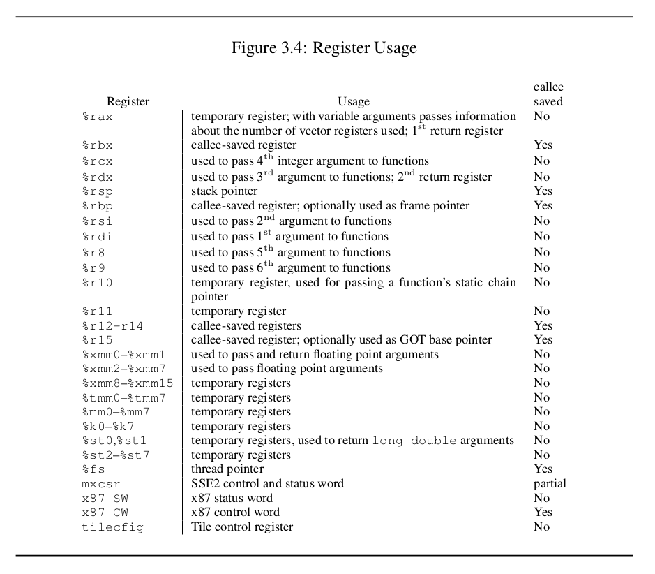

# Práctica 7 (10/11): Assembler
---
## Código de máquina vs assembly vs assembler vs archivos ejecutables
- **Assembly**: 
    - familia de lenguajes de programación que son muy parecidos al código de máquina. 
    - Basados en pilas, como [factor](https://factorcode.org)
    - texto
- **Código de máquina**: Diferencias con assembly: no tiene labels, formato binario
- **Archivo ejecutable**: formato específico para cada SO | "burocracia" | contiene código de máquina
- **Assembler**: convierte assembly a código de máquina y emite un archivo ejecutable.
---
## `nasm` y `as`
Hay [2 sintaxis de assembly](https://en.wikipedia.org/wiki/X86_assembly_language#Syntax) (ver link).
En linux:
- `as` y `gcc` pertenecen al proyecto GNU y compilan sintaxis AT&T
- `nasm` usa sintaxis intel
---
## ABI
Define un "código de conducta" que deben cumplir quien escribe código de máquina, y el procesador. **No** especifica:
- listado de syscalls
- listado de registros
- listado de instrucciones de assembly
Lo que nos interesa de este documento es la figura 3.4 (pag 25) que describe cómo se deben usar los registros según la ABI, aunque resulta más util leer código C desensamblado.

---

## ABI

---
## Labels
Un label marca una posición del programa que luego se puede poner en cualquier lugar donde se coloca un entero. El ensamblador reemplaza cada etiqueta por su posición relativa donde se escriban. Esto se usa para los jumps y para hacer referencia a datos literales que pueden incluirse en el programa.

---

## Nombres de los registros [(fuente)](https://cs.brown.edu/courses/cs033/docs/guides/x64_cheatsheet.pdf)

---
## Hoja de ruta para el repo de ejemplos
1. Imprimir texto con `syscall`
2. Imprimir texto con `puts`
3. Desensamblar y mostrar invocación a `printf`
4. `printf` en assembler
5. invocar a la subrutina `showit`
6. Desensamblar y mostrar invocación a `scanf`
7. combinar `scanf` y `printf`
8. Usar un ciclo para modificar el flujo del programa
---
## Ejercicios
1. Pedir 3 números por stdin e imprimir la suma
2. Pedir un número y luego pedir otro, seguir pidiendo otro hasta que el usuario vuelva a introducir el primero
3. Como el primer ejercicio pero diciendole al usuario si el número que ingresó recién es mayor o menor que el original
