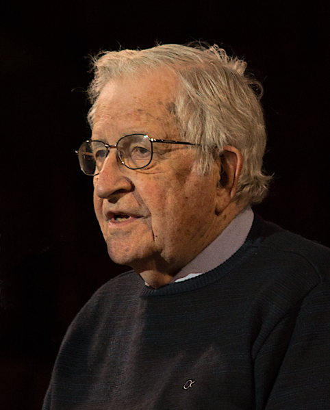

# ¿Por Qué Estudiar Compiladores?

## En Primer Lugar

> Un compilador es una fina pieza de ingeniería, en el cual cada engranaje debe funcionar con precisión superlativa. Cada uno de estos engranajes se sustenta sobre una inmensa base teórica. &#x2014;Mariano Méndez 


## En Segundo Lugar

-   Un  compilador <del>es</del> era un programa complejo y de Gran tamaño.

-   En la actualidad es un conjunto de  programas y bibliotecas que incluyen cientos de miles de líneas de código, incluso a veces millones de líneas. Están organizados en sub-sistemas que interactúan entre sí.

-   Un buen compilador contiene un microcosmos de las ciencias de la computación, utiliza:
    1.  Algoritmos Greedy              &#x2014;>  Alocación de registros
    2.  Programación Dinámica     &#x2014;> Selección de instrucciones
    3.  Autómatas Finitos               &#x2014;> Lexical Análisis
    4.  Push Down autómatas       &#x2014;>  Parsing
    5.  Alocación dinámica
    6.  Sincronización
    7.  Localidad
    8.  Gestión de Jerarquías da Memoria

Entre otras muchísimas cosas.


## En Tercer Lugar

Además escribir un compilador simple es desde el punto de vista educativo  un excelente proyecto, ya que mejora muchas habilidades para:

1.  la comprensión de los lenguajes de programación

2.  su diseño,

3.  estructura de datos

4.  diseño de algoritmos

5.  y una amplia gama de técnicas de programación.

Comprender cómo un lenguaje de alto nivel es traducido, de forma tal que puede ser ejecutado por el hardware **da** una espectacular idea de cómo el programa se comportará cuando este esté corriendo,  de donde estará el cuello de botella en la ejecución de las instrucciones individuales de alto nivel.

-   Estudiar cómo se construyen los compiladores colaborará en convertir a uno mismo en un mejor programador.


## En Cuarto Lugar

### Uno se Convierte en un Mejor Programador:

Un **craftman** tiene que comprender sus herramientas, y un programador no esta exento de esto. Mediante una mejor comprensión de como un compilador traduce un programa en código máquina uno se adquiere más habilidades en la escritura de código efectivo y sabe como debuguearlo cuando este falla.


### Uno Puede Crear Herramientas:

Si uno es capaz de crear un Parser para un lenguaje dado, esto le permite crear herramientas que proporcionan una mejor comprensión y análisis del código fuente de un programa. Además se podrá escribir herramientas como los IDE (Integrated Development Tools) que permiten ampliar las capacidades de un simple editor de texto agregando resaltado de sintaxis, refactorizaciones, métricas sobre el código escrito, entre otras muchas cosas.


### Crear Nuevos Lenguajes de Programación:

Increíblemente es posible obtener soluciones a problemas complejos, compactando estos en un determinado lenguaje ad-Hoc, este tipo de lenguaje se denomina **Domain Specific Languages** 

-   El caso de DOT, lenguaje para describir grafos

```    
    digraph graphname {   
       yellow -> orange -> red;  
       orange -> green; 
    }
```


### Contribuir con los Compiladores Existentes:

Es poco probable que uno escriba el próximo mejor compilador de C o Rust, pero estos desarrollos se encuentran en continuo cambio y actualización (GCC, Rust, Elixir,Python, por nombrar algunos). 

Todos ellos son un microcosmos en continuo cambio que necesitan:

-   el agregado de nuevas características del lenguaje,

-   portarlos a nuevas arquitecturas,

-   mejorar las optimizaciones que se hacen a los programas

Todas estas razones necesitan que los compiladores sean continuamente mejorados.


## Un Poco de Historia

1.  Hacia los años 40 con el advenimiento de la primera computadora con programa almacenado, de la mano de John Von Newmann, hizo necesario escribir secuencias de código o programas en **lenguaje de máquina**.

```
    C7 06 0000 0002
```

1.  Así para mover un valor literal 2 a una dirección de memoria se debía escribir la secuencia anterior de comandos, esto hacia imposible que se pudieran escribir programas rápidamente y de forma poco tediosa. Por ello nace el llamado **lenguaje ensamblador** , en el cual los códigos de instrucción se reemplazaron por 3 letras que representa una instrucción mnemotécnica y por direcciones de memoria que podían se dadas en forma simbólica.

```
    MOV X,2
```


3.  Lo que se buscaba era poder mejorar aun todas esas mejoras que el lenguaje ensamblador había introducido, de manera de simplificar aun más la escritura de programas

```
    X=2
```

4.  Entre 1954 y 1954 John Backus desarrollo el primer lenguaje de programación de alto nivel, FORTRAN I y su compilador.


## El Aporte de Noam Chomsky

-   Al mismo tiempo Noam Chomsky, lingüista estadounidense que aun vive, Comenzó a estudiar la estructura del **lenguaje natural**. Sus descubrimientos hicieron que la construcción de compiladores se volviera mucho más fácil e incluso pudiera ser automatizada en cierto grado.

-   Sus estudios desembocaron en una clasificación de los lenguajes de acuerdo con la complejidad de sus **gramáticas** y la potencia de los algoritmos necesarios para reconocerlas.
    
    


## La Jerarquía de Chomsky

-   Se compone de 4 niveles gramaticales:
    
    1.  Gramáticas de Tipo 0
    
    2.  Gramáticas de Tipo 1
    
    3.  Gramáticas de Tipo 2
    
    4.  Gramáticas de Tipo 3
    
    -   Las gramáticas de Tipo 2 o **Gramáticas libres de Contexto** resultaron ser las más útiles para los lenguajes de programación.

