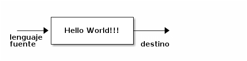
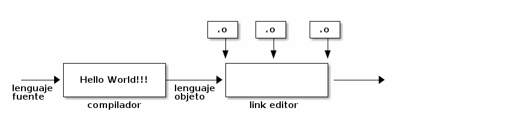

### Procesadores de Lenguaje

(Louden:chap1)

Existen diversos tipos de procesadores de lenguajes. A continuación se nombraran algunos que se estudiaran con más profundidad a lo largo de la materia:

-   Compiladores:

Si bien es parte central de la materia, un compilador puede ser definido de forma simple (Aho) como **un programa que puede leer un programa en un lenguaje (lenguaje fuente) y traducirlo en un programa equivalente en otro lenguaje (lenguaje destino)**



-   Interpretes:

Un intérprete es un traductor de lenguaje, igual que un compilador, pero difiere de éste en que ejecuta el programa fuente inmediatamente en vez de generar un código objeto que se ejecuta después de la traducción.

-   Cualquier lenguaje puede ser interpretado o compilado.

-   El interprete funciona en una iteración conocida como REPL ( Read-> Eval -> Print -> Loop) .


-   Editores de texto:

Los compiladores históricamente aceptan programas cuyo código fuente está escrito por un editor de texto. Con el tiempo estos editores han evolucionado en lo que se denominan IDEs, que permiten realizar operaciones con el compilador desde el mismo editor (i.e. Eclipse).


-   Preprocesadores

Un preprocesador es un programa que es invocado por el compilador antes de que comience la traducción real. Un preprocesador puede: eliminar comentarios, incluir otros archivos, ejecutar sustituciones de macros. Un ejemplo clásico es el CPP o C preprocesor del lenguaje C, aunque de tarea simple y meramente sustitutiva genera código complejo y condicional.


-   Ensamblador

Un ensamblador es un traductor para el lenguaje ensamblador (assembly) para una **arquitectura en particular** (x86, arm, risc-v, etc.) . El lenguaje ensamblador es una forma simbólica del lenguaje de máquina de una computadora y es particularmente fácil de traducir.

-   Linker o Enlazador

Un linker o linker-editor recopila código que se compila o ensambla por separado en diferentes archivos objetos, y los enlaza a un archivo que es directamente ejecutable. Aquí puede hacerse la distinción entre código objeto (aún no linkeditado) con código máquina ejecutable.




### Un Sistema de Procesamiento de Lenguaje

(Aho:chap1) Un sistema de procesamiento de lenguaje consiste en varios componentes que funcionan en una cola de procesamiento. Esta cola normalmente se inicia con un preprocesador y finaliza con el link editor o linker:


### Fases de un Compilación

(tiger:chap1)

1.  Análisis Léxico

    **Rompe el código fuente en palabras individuales, o tokens**
    
    -   Esta es la primera fase de un compilador se denomina *análisis léxico o escaneo*.
    
    -   El analizador léxico lee código fuente como un **flujo de caracteres** y los agrupa en secuencias significativas conocidas como **lexemas**.
    
    -   Para cada lexema el analizador léxico produce un **token** de la forma &#x2013;> {nombre-token,valor-atributo} (Aho:p6). El lexer toma un stream de caracteres y lo transforma en un stream de palabras clasificadas. Esto es pares de forma {p,s}, donde *p* es la **parte del discurso** de la palabra y *s* es como se escribe.
    
    -   Por ejemplo la frase "los compiladores son objetos ingenieriles", el lexer debería producir el siguiente stream:
    
    {articulo,"los"},{sustantivo,"compiladores"},{verbo, "son"},{sustantivo,"objetos"},{adjetivo,"ingenieriles"}
    
    -   Son unidades significativas que se corresponden a las palabras de un lenguaje natural (Lou:p8)
    
    -   El token es pasado a la fase siguiente que corresponde al análisis sintáctico como el stream de entrada para el parser.
    
    -   nombre-token: representa es un símbolo abstracto que se utiliza en la próxima fase.
    
    -   valor-atributo: apunta a una entrada en la tabla de símbolos para ese token.
    
    Por ejemplo una asignación en lenguaje C:
    
    ```C
    total = inicial + contador * 2
    ```
    
    El resultado una vez escaneada esa línea sería:
    
    {**id1**,1} {=} {**id2**,2} {+} {**id3**,3} {\*} {2}
    
    y la tabla de símbolos:
    
    | 1 | total    | &#x2026; |
    | 2 | inicial  | &#x2026; |
    | 3 | contador | &#x2026; |
    
    Cabe aclarar que el concepto de **token** se verá más detalladamente en el estudio de esta etapa especifica posteriormente.

2.  Análisis Sintáctico

    -   Esta el la segunda fase del compilador, también se denomina *parsing*. La idea es que el compilador trata de hacer corresponder el stream de palabras clasificadas contra las reglas que especifican la sintaxis del lenguaje de entrada. Por ejemplo en español algunas reglas gramaticales pueden ser :
    
    Oración -> Sujeto verbo Objeto marca de fin Sujeto -> Sustantivo Sujeto -> Sustantivo Modificador Objeto -> Nombre Objeto -> Sustantivo Modificador Modificador -> adjetivo &#x2026;
    
    -   El analizador sintáctico o parser es el que realiza este trabajo.
    
    -   Utiliza los primeros componentes de los tokens producidos por el lexer para crear una representación intermedia en forma de árbol que describa la estructura gramáticas del flujo de tokens.
    
    -   Esta representación se denomina **árbol sintáctico**. Este se caracteriza porque sus nodos intermedios representan operaciones y los hijos de estos nodos representan los argumentos.
        
        Para el ejemplo anterior :
    
    ```C
    total = inicial + contador * 2
    ```
    
    Cuyo resultado es: {**id1**,1} {=} {**id2**,2} {+} {**id3**,3} {\*} {2}
    
    se obtendría el siguiente árbol sintáctico
    
    
    
    -   Las fases siguientes utilizan la estructura gramatical para ayudar a analizar el código fuente y generar el programa destino.

3.  Análisis Semántico

    (lou:p9)
    
    -   La semántica de un programa es su "significado", en oposición a su sintaxis o estructura. La semántica de un programa determina su comportamiento durante el tiempo de ejecución, pero la mayoría de los lenguajes de programación tienen características que se pueden determinar antes de la ejecución e incluso no se pueden expresar de manera adecuada como sintaxis y analizarse mediante el analizador sintáctico. Tales características se denominan semántica estática, y el análisis de tal semántica es tarea del analizador semántico.
    
    -   La semántica "dinámica" de un programa, es decir, aquellas propiedades que solamente se pueden determinar al ejecutarlo no se pueden determinar mediante un compilador porque este no ejecuta el programa.
    
    -   Las características típicas de la semántica estática de los lenguajes de programación incluyen:
        -   las declaraciones
        -   la verificación de tipos
        -   conversiones de tipos de datos conocidas como coerciones (suma de un entero mas un flotante se obliga a convertir a flotante)
    
    

4.  Administración de la Tabla de Símbolos

    Una función muy importante del compilador durante las etapas de análisis léxico, análisis sintáctico y análisis semántico es la de registrar los nombres de las variables que se utilizan en el código fuente, y recolectar información sobre varios atributos de cada nombre.
    
    -   Estos atributos pueden proporcionar información acerca del espacio de almacenamiento que se asigna para un nombre, su tipo, su alcance.
    
    -   En el caso de las funciones registra los nombres, el tipo y numero de argumentos, el método para pasar cada argumento y el tipo devuelto.
    
    -   La tabla de símbolos es una estructura de datos que contiene un registro para cada nombre de variable, con campos para los atributos del nombre. Esta estructura de datos debe diseñarse de forma tal que permita al compilador buscar el registro para cada nombre, y almacenar u obtener datos de ese registro con rapidez.
    
    (ajo:p11)

5.  Generación de código intermedio

    -   En el proceso de traducir código fuente a código destino, un compilador puede construir una o mas representaciones intermedias que pueden tener una variedad de formas.
    
    -   Los arboles sintácticos son una forma de representación intermedia que por lo general se utilizan durante el análisis sintáctico y semántico.
    
    -   Posteriormente a estas dos fases los compiladores generan una representación similar al código maquina que se puede considerar como un programa para una maquina abstracta (aho:p9).
    
    -   Esta representación intermedia debe tener dos propiedades:
        -   debe ser fácil de producir y fácil de traducir en la maquina destino
    
    ```C
    t1=inttofloat(60)
    t2=id3 * t1
    t3=id2 + t2
    id1= t3
    ```
    
    -   Posteriormente se abordara las principales representaciones intermedias que se utilizan comúnmente en los compiladores.

6.  Front-end de un compilador

    Todas las fases enumeradas hasta este punto conforman el front-end de un compilador moderno.
    
    
    
    A partir de este punto la siguiente etapa es llevada a cabo por el optimizador.

7.  Optimización de código

    -   En esta fase se optimiza el código intermedio generado en la fase anterior que es independiente de la arquitectura de la maquina en la que se generara el código destino. Su objetivo es mejorar el código intermedio de forma tal que produzca mejor código destino.
    
    -   Mejor significa:
        -   más rápido
        -   obtener código mas corto
        -   generar código destino que consuma menos energía
    
    -   Siguiendo con el ejemplo anterior el algoritmo de optimización de código IR generaría el siguiente código:
    
    ```C
    t1 = id3 * 60.0
    id1 = id2 + t1
    ```

8.  Back-End de Un Compilador

    A partir de este punto entra a jugar el denominado Back-End de un compilador moderno que se encarga de la generación de código destino a partir de la arquitectura de la maquina que ejecutará el programa.

9.  Generador de código

    -   El generador de código toma el código intermedio y genera el código para la arquitectura de la maquina destino. Normalmente se genera en este punto el código objeto de la maquina destino directamente.
    
    -   Si el lenguaje destino es código maquina, se seleccionan registros y/o posiciones de memoria para cada una de las variables utilizadas en el programa.
    
    -   Posteriormente, las instrucciones intermedias se traducen en secuencias de instrucciones maquina que realizan la misma tarea.
    
    -   Un aspecto importante de esto es la asignación juiciosa de los registros para guardar las variables.
    
    ```text
    LDF     R2,id3
    MULF    R2,R2,#60.0
    LDF     R1,id2
    ADDF    R1,R1,R2
    STF     id1,R1
    ```
    
    (leer Coo:p15)

10. Optimizador de código destino

    -   En esta fase el compilador intenta mejorar el código destino generado en la etapa anterior.
    
    -   Estas mejoras pueden ser:
        -   selección de modos de direccionamiento para mejorar el rendimiento
        
        -   reemplazo de instrucciones lentas por otras rápidas
        
        -   eliminar operaciones redundantes o innecesarias
    
    -   Algunos de estos ejemplos pueden ser: eliminar la multiplicación utilizando corrimientos, utilizar el redireccionamiento indexado para realizar el almacenamiento de arreglos.


### Estructuras de Datos Principales en un Compiladores

(Lou:p13)

1.  Tokens

    Generalmente cuando el analizador léxico reúne los caracteres correspondientes a un token, representa al token de manera **simbólica**, es decir, como un valor de un tipo de dato enumerado que representa al conjunto de tokens del lenguaje fuente.
    
    ```C
    typedef enum  { T_END_OF_INPUT, T_VAR, T_IDENTIFIER, T_LPAREN, ... }
    TokenType;
    ```
    
    -   En ocasiones también es necesario mantener la cadena de caracteres misma u otra información derivada de ella, tal como el nombre asociado con un token identificador o el valor de un token numero.
    
    -   En la mayoría de los lenguajes el analizador léxico solo necesita generar un token a la vez (esto se conoce como búsqueda de símbolo simple).

2.  Árbol Sintáctico

    El analizador sintáctico genera una estructura de datos que representa un árbol n-ario y lo hace en forma dinámica a medida que se efectúa dicho análisis. Normalmente el árbol entero se puede conservar como una estructura en la cual se apunta a un nodo raíz y este a sus hijos.
    
    -   Cada nodo de la estructura es un registro cuyos campos representan la información recolectada tanto por el analizador sintáctico como, posteriormente, por el analizador semántico.

3.  Tabla de Símbolos

    Esta estructura de datos mantiene la información asociada con los identificadores:
    
    -   funciones
    -   variables
    -   constantes
    -   tipos de datos
    
    -   La tabla se símbolos interactúa con casi todas las fases de compilación:
        -   analizador léxico
        -   analizador sintáctico
        -   analizador semántico
        -   generación de código y optimización de código intermedio
    
    -   Dado que la tabla de símbolos tiene acceso con tanta frecuencia las operaciones de inserción, eliminación y acceso necesitan ser muy eficientes, preferiblemente operaciones de tiempo constante (O(1))

4.  Tabla de Literales

    La tabla de literales almacena constantes y cadenas que se utilizan el programa.
    
    -   Sus operaciones de acceso y búsqueda deben ser rápidas.
    
    -   La tabla de literales es importante en la reducción del tamaño de un programa en la memoria al permitir la reutilización de constantes y cadenas.