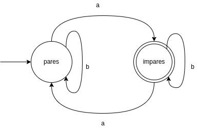

# Laboratorio 1: Resumen teórico
Breve repaso de DFA (Autómata Finito Determinístico)

## Composición de un DFA
- Alfabeto $\Sigma$
- Conjunto de estados $D$
- Función de transición $T:D\times\Sigma\rightarrow D$
- Estado inicial $S_0 \in D$
- Estados de aceptación $A \subset D$

Un DFA es una tupla $(\Sigma,D,T,S_0,A)$.

Esta definición tiene su equivalente en código en el archivo `common.ts`, donde `Alphabet` ($\Sigma$) y `State` ($D$) son parámetros de tipo.

```ts
export interface MachineDescription<Alphabet, State> {
  transition: Transition<Alphabet, State>;
  initial: State;
  acceptance: State[];
}
```

## Cómo visualizar un DFA
El siguiente DFA detecta un número impar de letras `a`.



- Alfabeto $\Sigma$: letras sobre las transiciones
- Conjunto de estados $D$: cada círculo es un estado
- Función de transición $T:D\times\Sigma\rightarrow D$: flechas entre estados con una letra al lado
- Estado inicial $S_0 \in D$: La apunta una flecha que viene desde afuera
- Estados de aceptación $A \subset D$: Estado con un reborde.

## Cómo describir un DFA
A continuación se describe el mismo DFA sin un diagrama.

- Alfabeto $\Sigma = \{a,b\}$
- Conjunto de estados $D=\{pares, impares\}$
- Estado inicial $S_0 = pares$
- Estados de aceptación $A={impares}$
- Función de transición $T:D\times\Sigma\rightarrow D$: tabla a continuación

|estado|letra|nuevo estado|
|-|-|-|
|$pares$|$a$|$impares$|
|$pares$|$b$|$pares$|
|$impares$|$a$|$pares$|
|$impares$|$b$|$impares$|

## Para qué sirven las DFA
- [Análisis estático que extrae DFA de tu código java](https://www.researchgate.net/publication/269384270_Extracting_finite_state_representation_of_Java_programs)
- Las expresiones regulares representan DFA
- [redux](https://redux.js.org) usa conceptos similares
- Es una excelente forma de modelar el estado y los cambios de estado de nuestros programas