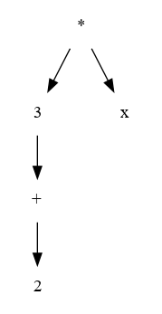
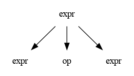

### El Proceso de Análisis Sintáctico

(Lou:p96)

-   La tarea del **analizador sintáctico** es determinar la **estructura sintáctica** de un programa a partir de los tokens producidos por el **analizador léxico** y construir un **árbol de análisis gramatical o sintáctico** que represente esta estructura.


-   Básicamente la idea es la siguiente:

```C
syntax_tree = parse();
```




-   Para que esto sea posible &#x2026;.

### Introducción Gramáticas

(Aho:p191)

-   Los lenguajes de programación tienen por diseño reglas precisas que describen la estructura sintáctica de los programas escritos correctamente. Así como una frase en español tiene una estructura sintáctica que hace que podamos a través de su análisis inferir su semántica. Lo mismo pasa con los lenguajes de programación como por ejemplo C.
-   La sintaxis de las construcciones de un de un lenguaje de programación puede especificarse mediante **gramáticas libres de contexto** con la notación BNF (Backus-Naur Form).

-   Las gramáticas ofrecen los siguientes beneficios:
    
    -   Proporcionan una especificación sintáctica precisa de un lenguaje de programación y fácil de entender.
    
    -   A partir de ciertas clases de gramáticas, se puede construir de manera automática un analizador sintáctico eficiente que determine la estructura sintáctica del código fuente de un programa.
    
    -   La estructura impartida a un lenguaje mediante una gramática diseñada en forma apropiada es útil para traducir código fuente en código objeto correcto, y permite detectar errores.
    
    -   Las gramáticas permiten la evolución de los lenguajes a los que se les puede agregar nuevas construcciones para realizar nuevas tareas.


#### Convención de Notación

1.  Símbolos Terminales:

    1. Las primeras letras de minúsculas del alfabeto, como a, b, c
       
    2. Símbolos de operadores como +,-, &lowast;(), etc.
       
    3. Símbolos de puntuación como paréntesis, coma, punto y coma, etc.
    
    4. Los dígitos 0,1,2,&#x2026;.,9.
       
    5. Las cadenas en negrita como **if**, **while**.
    
2.  Símbolos No Terminales:
  
    1.  Las Primeras Letras del Alfabeto, como, A,B,C.
        
    2.  La letra S que por lo general es considerado el símbolo inicial, que por lo general es la primera regla.
    
    3.  Los nombres en minúsculas y cursiva. _expr_, _term_  
    
    4.  Al hablar sobre las construcciones de programación, las letras mayúsculas pueden utilizarse para representar símbolos no terminales. Por ejemplo los no terminales para las expresiones, términos y los factores se representan como E, T y F.
    
    3.  Las letras mayúsculas X, Y y Z que pueden ser terminales o no terminales.
    
    4.  Las letras minúsculas del alfabeto , como u,v,&#x2026;.,z representan cadenas de terminales, normalmente vacías.
    
    5.  Las letras griegas minúsculas &alpha;, &beta;, &gamma;, representan cadenas ( posiblemente vacías) de símbolos gramaticales.


#### Backus-Naur Form

Backus normal form, es un metalenguaje usado para expresar gramáticas libres de contexto: es decir, una manera formal de describir lenguajes formales.

BNF se utiliza extensamente como notación para las gramáticas de los lenguajes de programación, etre otros, así como una notación para representar partes de las gramáticas de la lengua natural. La mayoría de los libros de textos para la teoría o la semántica del lenguaje de programación documentan el lenguaje de programación en BNF.

John Backus,  adoptó las reglas generativas de Chomsky para describir la sintaxis del nuevo lenguaje de programación IAL, conocido en la actualidad como ALGOL 58 (1959), presentando en el primer Congreso de Computación Mundial (World Computer Congress) el artículo «The syntax and semantics of the proposed international algebraic language of the Zurich ACM-GAMM Conference».

Peter Naur, en su reporte sobre ALGOL 60 de 1963, identificó la notación de Backus como la Forma Normal de Backus (Backus Normal Form), y la simplificó para usar un conjunto de símbolos menor, pero a sugerencia de Donald Knuth, su apellido fue agregado en reconocimiento a su contribución, reemplazando la palabra «Normal» por Naur, dado que no se trata de una forma normal en ningún sentido, a diferencia, por ejemplo de la Forma Normal de Chomsky.

##### Notación
Una especificación de BNF es un sistema de reglas de derivación, escrito como:
```text
<simbolo> ::= <expresión con símbolos>
```
o
```text
<simbolo> -> <expresión con símbolos>
```
donde:
 - <símbolo> es un no terminal, 
 - y la expresión consiste en secuencias de símbolos o secuencias separadas por la barra vertical, '|', indicando una opción, el conjunto es una posible substitución para el símbolo a la izquierda. 
 - Los símbolos que nunca aparecen en un lado izquierdo son terminales.

#### Ejemplo

Como ejemplo, considere este BNF para una dirección postal de los EE. UU.

```
<dirección postal> -> <nombre> <dirección> <apartado postal>

<nombre> -> <personal> <apellido> [<trato>] <EOL> 
         | <personal> <nombre>
         
<personal> -> <primer nombre> | <inicial> "."

<direccion> -> [<dpto>] <numero de la casa> <nombre de la calle> <EOL>

<apartado postal> -> <ciudad> "," <código estado> <código postal> <EOL>
```

Esto se traduce a español como:
  Una dirección postal **consiste en** un nombre, seguido por una dirección, seguida por un apartado postal.
  Una parte «personal» **consiste en** un nombre o una inicial seguido(a) por un punto.
  Un nombre consiste de: una parte personal seguida por un apellido seguido opcionalmente por una jerarquía **o** el trato que se la da a la persona (Jr., Sr., o número dinástico) y un salto de línea (end-of-line), **o** bien una parte personal seguida por un nombre (esta regla ilustra el uso de la repetición en BNFs, cubriendo el caso de la gente que utiliza múltiples nombres y los nombres medios o las iniciales).
  Una dirección **consiste de** una especificación opcional del departamento, seguido de un número de casa, seguido por el nombre de la calle, seguido por un salto de línea (end-of-line).
  Un apartado postal **consiste de** una ciudad, seguida por una coma, seguida por un código del estado (recuerde que es un ejemplo que ocurre en EE. UU.), seguido por un código postal y este seguido por un salto de línea (end-of-line).

Observar que muchas cosas (tales como el formato de una parte personal, de una especificación del apartamento, o código postal) están dejadas sin especificar aquí. Si es necesario, pueden ser descritas usando reglas adicionales de BNF, o dejadas como abstracción si es inaplicable para el propósito actual.


### Gramáticas Libres de Contexto

-   Una **gramática libre de contexto** es una especificación para la estructura sintáctica de un lenguaje de programación.

-   Es muy similar a la especificación léxica de un lenguaje utilizando expresiones regulares, excepto que una gramática libre de contexto **involucra reglas de recursividad**.

1. Definición

   Una **gramática libre de contexto** tiene cuatro componentes:

   1.  Un conjunto de símbolos **terminales**, son símbolos elementales del lenguaje definido por la gramática (i.e. **while,for**)

   2.  Un conjunto de **no terminales** ( variables sintácticas) que representan un conjunto de cadenas o terminales.

   3.  Un conjunto de **producciones**, que consiste en un no terminal llamado lado izquierdo **LHS**, una flecha y una secuencia de terminales y no terminales, llamado lado derecho **RHS**. La idea es especificar una de las formas escritas de una instrucción si el LHS representa a una instrucción y el RHS representa la forma escrita de la instrucción.

   4.  Una designación de uno de los no terminales como **símbolo inicial**.

   -   Una gramática G=(V,T,P,S), donde :
       -   V= no terminales
       -   T=Terminales
       -   P=Producciones
       -   S=Símbolo inicial

```text
   lista  -> lista + digito
   lista  -> lista - digito
   lista  -> digito
   digito -> 0|1|2|3|4|5|6|7|8|9
```

   también puede agruparse de la siguiente manera:

```text
   lista  -> lista + digito
          | lista - digito
          | digito
   
   digito -> 0|1|2|3|4|5|6|7|8|9
```

donde el "|" se lee como o


​    
##### Gramática para expresiones regulares simples:

```text
    expresion -> expresion + termino  
    expresion -> expresion - termino
    expresion -> termino
    termino   -> termino * factor
    termino   -> termino / factor
    termino   -> factor
    factor    -> ( expresion )
    factor    -> id
```


​    
```text
    expresion -> expresion + termino  
    	      | expresion - termino
    	      | termino
    
    termino   -> termino * factor
    	      | termino / factor
    	      | factor
    
    factor    -> ( expresion )
    	      | id
```


​    
```text
    E  -> E + T | E - T | T 
    T  -> T * F | T / F | F 
    F  -> ( E ) | id
```


### Derivaciones

(Lou:p100) 

Las reglas gramaticales determinan las cadenas legales de símbolos de token por medio de derivaciones. Una **derivación** es *una secuencia de reemplazos de nombres de estructura por selecciones en los lados derechos de reglas gramaticales*.

En otras palabras, (Aho:p44) **una gramática deriva cadenas empezando con el símbolo inicial y sustituyendo en forma repetida un no terminal, mediante el cuerpo de una producción para ese no terminal**.

- Una derivación es una construcción, en la cual se aplican las producciones de una gramática para obtener una cadena de terminales. Es decir, sustituir la variable de LHS por las del RHS.

- Existen dos tipos de derivaciones:
    -   Derivación **hacia la izquierda**, en la que se sustituye siempre el nodo no terminal que se encuentra más a la izquierda.
    
    -   Derivación **hacia la derecha**, en el que se sustituye siempre el nodo no terminal que se encuentra más a la derecha.

1. Ejemplo:

   Sea la gramática:

```text
   expr -> expr op expr
        | intLit
        | id
        
   op   -> + | * 
```

   G=( {expr,op}, {+, \*, inLit, id}, P, expr )

Se quiere demostrar usando la gramática anterior que la cadena " 2 + 3 \* x " es válida respecto a la gramática. Aplicando derivación hacia la izquierda, empezando por la primera producción que es el símbolo inicial :
expr => _expr_ op expr                                     //expr  -> intLit  
   => intLit _op_ expr                                         //op     -> + 
   => intLit + _expr_                                         //expr  -> expr op expr 
   => intLit + _expr_ op expr                          //expr  -> intLit 
   => intLit + intLit _op_ expr                        //op      -> *  
   => intLit + intLit * _expr_                           //id       -> x  
   => intLit + intLit * id

   La serie de remplazos de arriba se denomina **derivación**, cada paso de la derivación reemplaza un símbolo no terminal por alguna de sus producciones alternativas.

   1.  Árbol Sintáctico

       (Moo:p37)
       
       Teniendo en cuenta el ejemplo anterior de la misma forma puede hacerse pero para crear un árbol:
       
       -   Se comienza por el símbolo S, en este caso expr => expr op expr
       
       
       
       Insertando recursivamente las derivaciones faltantes se obtiene el siguiente árbol
       
       
       
       Esta estructura se denomina **Árbol Sintáctico** de la gramática G, y tiene las siguientes propiedades:
       
       -   Las hojas (nodos terminales) están etiquetadas por los símbolos no terminales.
       
       -   Los nodos interiores ( nodos no terminales) están etiquetados por los símbolos no terminales.
       
       -   Los hijos de un nodo interior N corresponde a la regla para N, teniendo en cuenta el nivel.
       
       Que sucede si se elige una derivación por la izquierda utilizando otra producción, es decir expr => expr or expr // expr-> expr or expr ? (hacerlo como repaso):
       
       
       
       Hay un claro problema, la **gramática es ambigua**. Una gramática es ambigua cuando produce más de una derivación por la izq o por la derecha.

   2. Tipos  de Recursividad en las Producciones

      -   **Recursividad**
          
          Al analizar la recursividad en gramáticas, y por lo tanto también en el lenguaje generado, podemos hacer una analogía con el concepto de función recursiva en el ámbito de la programación, donde una función es recursiva cuando se llama a sí misma.

      -   **Producciones Recursivas**
          
          Una producción es recursiva cuando el símbolo no terminal del lado izquierdo de la regla de producción, aparece también en el lado izquierdo de la misma.
          
          Las siguientes producciones son recursivas: A &rarr; 0A1, B := BA01

      -   **Producciones recursivas por izquierda**
          
          Una producción es recursiva por izquierda cuando el símbolo no terminal del lado izquierdo de la regla de producción, aparece en primer lugar en el lado derecho de la misma.
          
          Ejemplo: A &rarr; Ac

          
          
      -   **Producciones recursivas por derecha**
          
          Una producción es recursiva por derecha cuando el símbolo no terminal del lado izquierdo de la regla de producción, aparece en el último lugar en el lado derecho de la misma.
          
          Por ejemplo, la siguiente producción es recursiva por derecha: B &rarr; aB
          
          

   4.  Árboles

       1.  **Árbol de Análisis Gramatical** o Parse Tree o Árbol de Análisis Sintáctico
       
           (lou:p109) Un árbol de análisis gramatical o árbol sintáctico de una Gramática es una representación útil de la estructura de una cadena de tokens, ya que los tokens aparecen como las hojas del árbol ( de izquierda a derecha) y los nodos internos del árbol representan los pasos dela derivación (en algún orden).
           
           -   Estos árboles contienen mucha información, más de la necesaria para que el compilador produzca código ejecutable.
           
           
       
       2.  Árbol Abstracto de Sintaxis o AST
       
           Un árbol abstracto de sintaxis o AST contiene la información mínima para poder traducir a código ejecutable de una forma más eficiente que los arboles gramaticales.
           


           
Es una representación abstracta de la secuencia de tokens del código fuente real, estas secuencias no se pueden recobrar a partir de ellas.

### Nomenclatura de Analizadores Sintácticos

Los parsers se nombran según :

-   La dirección de parse:
    -   L: Parseo de Izquierda a derecha (**Parse from Left to right**)
    -   R: Parseo de Derecha a izquierda (**Parse from Right to Left**)

-   La resolución de las derivaciones
    -   L: Derivacion hacia la izquierda (**Left most derivation**)
    -   R: Derivación hacia la derecha (**Right most derivation**)

-   El símbolo de entrada de anticipacón o Lookahead Es la cantidad de simbolos de entrada de anticipacion , patra tomar decisiones de acción del analisis sintáctico.

Entonces **LL(1)** es un analizador sintáctico que parsea de Izquierda a derecha, con derivaciones hacia izquierda con 1 caracter de anticipación.


###  Tipos de Analizadores Sintácticos

#### Analizadores Sintácticos de Descendiente Recursivo

(lou:p143)

El algoritmo del análisis sintáctico **descendente** analiza una cadena de tokens de entrada mediante la búsqueda de las producciones o pasos de derivación por izquierda. El algoritmo se denomina así debido a que el recorrido implicado del árbol de análisis gramatical es un recorrido en **pre-orden** , y de ese modo se presenta desde la raíz hacia las hojas.

Puede verse como el problema de construir un árbol de análisis sintáctico para la cadena de entrada , partiendo del nodo raíz y creando los nodos del árbol sintáctico en pre-orden (Aho:p217).

-   En cada paso de un análisis sintáctico descendente, el problema clave es el de determinarla producción que debe aplicarse para un no terminal.

1.  Ejemplo 1

    (tiger:p47)
    
    Sea la siguiente gramática:
    
```text
    S -> if E then S else S 
    S -> begin S L
    S -> print E
    
    L -> end 
    L -> S L 
    
    E -> num = num 
```

A continuación se genera un parser para la gramática anterior aplicando el algoritmo conocido como recursivo descendente. Este tiene una sola función por cada símbolo no terminal y una clausula para cada producción:
    
```C
    enum token {IF, THEN, ELSE, BEGIN, END, PRINT, PUNTOYCOMA, NUMERO, IGUAL};
    
    extern enum token get_token(void);  // yylex()
    
    enum token tok;
    
    void avanzar(){
        tok=get_token();
    }
    
    void consumir (enum token t){
        if (tok=t) avanzar();
        else error();
    }
    
    void S (void){
        switch(tok){
    
        case IF: 
    	 consumit(IF); E(); consumir(THEN); S();
    			    consumir(ELSE); S();
    	 breack;  
    
        case BEGIN:
    	 consumir(BEGIN); S(), L();
    	 breack;
    
        case PRINT: 
    	 consumir(PRINT); E();
    
        default: 
    	error();
        }
    }
    
    void L (void){
        switch (tok){
    	case END:
    	    consumir(END);
    	    break;
    	case PUNTOYCOMA:
    	    consumir(PUNTOYCOMA); S(); L();
    	    break;
    	default:
    	error();
        } 
    }
    void E (void){
        consumir(NUM); consumir(IGUAL); consumir(NUM);
    } 
```

Con get\_token() y error(); andando este fragmento de código funciona perfectamente.
    
Intentar realizar lo mismo para la siguiente gramatica:
    

```text
    S -> E$
    
    E -> E + T 
    E -> E - T 
    E -> T
    
    T -> T * F
    T -> T / F 
    T -> F
    
    F -> id
    F -> num
    F -> (E)
    
```

El análisis sintáctico de descenso recursivo, o predictivo, solo funciona en gramáticas donde el primer símbolo terminal de cada sub-expresión provee suficiente información para elegir que producción usar.
