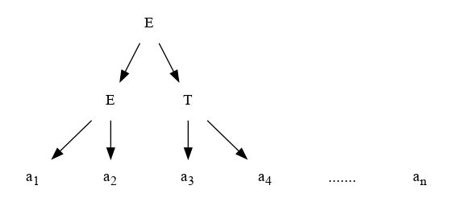
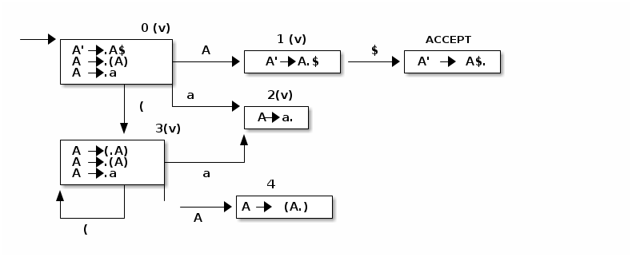
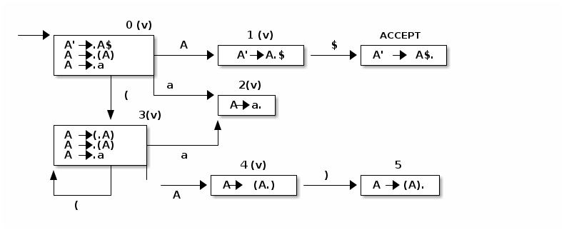

4.  Analizadores Sintácticos Ascendentes

    Con la misma terminología que a los analizadores sintácticos descendentes, el algoritmo más general se lo denomina **análisis sintáctico LR(1)**. **L** indica que que procesa de izquierda a derecha (left-to-right), y la **R** indica que produce una derivación por la derecha, **rightmost derivation**. Mientras que el 1 indica que se utiliza 1 símbolo de búsqueda hacia adelante.
    
    Una consecuencia de la potencia del análisis sintáctico ascendente es el hecho de que tambien puede hablarse de **LR(0)** , donde no hay ninguna b usqueda hacia adelante para tomar decisiones de análisis sintáctico: **esto es posible porque un token de búsqueda hacia adelante se puede examinar despues que aparece en la pila de análisis sintáctico**, si esto ocurre no cuenta como búsqueda hacia adelante.
    
    Una mejora en el análisis sintáctico LR(0) que hace algún uso de búsqueda hacia adelante se conoce como **análisis sintáctico SLR(1)** , por Simple Left LR(1) parser.
    
    Por último un método menos complejo que el SLR(1) y más potente se denomina **análisis sintáctico LALR(1)**, por Lookahead LR(1) parsing.

5.  Analizador Sintactico LR simple

    -   Análisis Sintáctico: dada una gramática G=(N, &Sigma;, P, S) y una cadena &alpha;, el analisis sintáctico consiste en determinar si \alpah &isin; L(G), es decir si pertenece al lenguaje generado por G y, en tal caso dar una derivación S &rArr; &lowast; &alpha;.
    
    -   Cuando se habla de S &rArr; &lowast; &alpha;, nos referimos una derivación que parte del símbolo inicial y llega aplicando derivaciones a &alpha;.
    
    En el **análisis sintáctico ascendente** el parser en cada paso tiene un árbol de derivación, que se va completando **desde las hojas hacia la raiz**, consumiendo símboilos de entrada y **reduciendo** producciones:
    
    Sea una gramática G con un conjunto de producciones: &#x2026; &#x2026; E &rarr; a<sub>1</sub>a<sub>2</sub> T &rarr; a<sub>3</sub>a<sub>4</sub> E &rarr; E + T
    
    
    
    dado que dentro del conjunto de producciones se tiene una producción E &rarr; a<sub>1</sub>a<sub>2</sub>, se pueden consumir a<sub>1</sub> y a<sub>2</sub> y agrego E como nuevo nodo del árbol de derivación:
    
    
    
    Ahora se puede aplicar otra regla T &rarr; a<sub>3</sub>a<sub>4</sub> y volver a generar el árbol:
    
    
    
    Ahora se aplica la regla E &rarr; E T, se vuelve a realizar la sustitución:
    
    
    
    Los analizadores sintácticos ascendentes se llevan bien con las gramáticas que tienen recursión hacia la **izquierda**, al contrarios que los parsers descendentes ( LL(1) ) que se llevan bien con la recursividad a **derecha**.
    
    Los analizadores sintácticos ascendentes realizan dos acciones importantes:
    
    -   **Shift o Consumir**: consume una entrada en la pila
    
    -   **Reduce o Reducir**: dados un conjunto de símbolos que matchean en alguna producción se sustituye esa regla con el no terminal correspondiente.


<a id="orgdc383d2"></a>

### Ejemplo:

Sea la gramática G=( {E,T}, {n,+}, P, E ) con el siguiente conjunto de producciones:

E &rarr; T | E + T T &rarr; n

la cadena n+n+n pertenece al lenguaje generado por la graática?


Se puede seguir aplicando reduce o shift:


el árbol final :


Como se puede ver al final se produce una derivación **right-mos** o hacia derecha. Por Ejemplo para validar la cadena m+m se generan los siguientes árboles:


| Pasos | Acción |           |
| 1     | shift  | n         |
| 2     | reduce | t->n      |
| 3     | reduce | E->T      |
| 4     | shift  | n +       |
| 5     | shift  | n + n     |
| 6     | reduce | T -> n    |
| 7     | reduce | E-> E + T |
| 8     |        | E         |

La derivación se construye de atrás hacia adelantes


-   Cada paso de la derivación aporta pasos desde el dinal hacia el principio.

-   El análisis sintáctico ascendente consume de izquierda a derecha los símbolos y da como resultado una derivación más a la derecha: LR


<a id="org986c679"></a>

### Caso General

En un momento determinado del análisis sintáctico para una cadena &alpha; = a<sub>1</sub>a<sub>2</sub>..a<sub>n</sub> ya se construyeron j sub-árboles del árbol de derivación. Esto quiere decir que hay una **pila de árboles**:


la concatenación de todas las hojas de todos los árboles forman la entrada:

poner imagen 2

El análisis sintáctico ascendente tiene tres posibles casos:

-   Si existe un **k** tal que los **k** simbólos X<sub>j-k+1</sub> &#x2026;. X<sub>j</sub> en el tope de la pila corresponden al lado derecho de una producción A-> X<sub>j-k+1</sub> &#x2026;. X<sub>j</sub>, se aplica un **reduce** creando un nuevo nodo A con dichos k árboles como hijos.
    
    Esto quiere decir que si se tienen X<sub>1</sub> &#x2026;. X<sub>j</sub> árboles si los últimos **k** árboles ( j-k+1 &#x2026;. j ) son justo el lado derecho de una producción se aplica un **reduce**.


Es decir se sacan k árboles de la pila y se pone uno nuevo que contiene a los demás k árboles colgando de una misma raiz.

-   Si todavía hay símbolos de entrada para consumir, se aplica el paso **shift** incorporando el siguiente símbolode la entrada en la pila teniendo **j+1** árboles donde el último sólo tiene una hoja.

-   Si no hay símbolos para consumir y no es posible reducir la cadena de la pila; si queda un único árbol de derivación con raiz S= X<sub>1</sub> &#x2026;. X<sub>j</sub> la cadena se acepta sino se rechaza.

El problema más importante a resolver es saber que **acción** hay que realizar si un **shift** o un **reduce**.


### Analisis Ascendente con Asistente

Se va a suponer que se dispone de un asistente inteligente, un bot, que puede determinar automáticamente si hay que realizar si un **shift** o un **reduce, y en el caso de tener que hacer un reduce \*determina** siempre la producción correcta del conjunto de producciones. El asistente indicará qué producción utilizar.

1.  El Algoritmo

    ENTRADA: Una gramática G=(N, &Sigma;, P, S) y una cadena &alpha;
    
    SALIDA: Un booleano que indica si &alpha; &isin; L(G), en el caso de ser verdadero devuelve una derivación más a la derecha de S &rArr; &lowast; &alpha;
    
    ```C
    
    pila=[]
    while(1){
        if asistente elige una producción A->X1 .... Xk donde X1 ...Xk son k simbolosen el tope de la pila  (Xk es el tope de la pila)
      {  //reduce
         sacar k simbolos de la pila
         pila.push(A)
         Agregar la produccion como primer paso de derivacion construido
      } 
      else if alpha no es vacia y abeta=alpha
      {  // shift
         sea abeta=alpha
         pila.push(a)
         alpha= beta realizar si un *shift* o un *reduce* 
      }
      else if pila =[S] 
           return true // existe alpha que pertenece a L(G) con la derivacion
      else 
           return false // alpha no pertenece a L(G) 
    }
    ```
    
    1.  Ejemplo
    
        Sea G=( {Exp, Term, Factor}, { +, n, \*, (, ) }, P, E) con el siguiente conjunto de producciones:
        
        Exp &rarr; Term | Eexp + Term Term &rarr; Factor | Term \* Factor Factor &rarr; n | ( Exp)
        
        Determinar si la cadena n\*n+n pertenece a L(G)
        
        | Pila           | Entrada | Operación | produccion           |
        |                | n\*n+n  | shift     |                      |
        | n              | \*n+n   | reduce    | Factor->n            |
        | Factor         | \*n+n   | reduce    | Term->Factor         |
        | Term           | \*n+n   | shift     |                      |
        | Term \*        | n+n     | shift     |                      |
        | Term \* n      | +n      | reduce    | Factor->n            |
        | Term \* Factor | +n      | reduce    | Term->Term \* Factor |
        | Term           | +n      | reduce    | Exp->Term            |
        | Exp            | +n      | shift     |                      |
        | Exp +          | n       | shift     |                      |
        | Exp + n        | $       | reduce    | Exp->Exp + Fact      |
        | Exp + Factor   | $       | reduce    | Fact->Term           |
        | Exp + Term     | $       | reduce    | Exp->Exp + Term      |
        | Exp            | $       | reduce    | E->S                 |
        | S              |         |           |                      |
        
        E=S se acepta la cadena
        
        El problema es como determinar automaticamente si la acción a aplicar es un **shift** o un **reduce**


### Analizador Sintáctico LR(0)

Dado que no se tiene un asistente inteligente en la realidad es necesario un mecanismo por el cual se pueda determinar en forma certera que acción hay que realizar. Para ello se va a utilizar un **Automáta Finito Determinista** que va a decidir si se efectua un shift o un reduce y ademas el autómata va a indicar por que producción hay que reducir.

-   Definición:

Si G=(N, &Sigma;,P,S) es una gramática libre de constexto, se denomina **elemnto** a una producción que tiene un puntito en algún lugar, es decir , un elemnto es de la forma A&rarr; &alpha;.&beta;, donde (A&rarr; &alpha;&beta;) &isin; P, es una producción y &alpha; y &beta; son cadenas de cualesquiera incluyendo a &epsilon;.

Sea la gramática :

S' &rarr; S S &rarr; (S) | &epsilon;

la gramatica tiene 3 reglas de producción:

S' &rarr; S S &rarr; (S)S S &rarr; &epsilon;

y ocho elementos

1.  S' &rarr; .S
2.  S' &rarr; S.
3.  S &rarr; .(S)S
4.  S &rarr; (.S)S
5.  S &rarr; (S.)S
6.  S &rarr; (S).S
7.  S &rarr; (S)S.
8.  S &rarr; .

un elemento se puede implementar como un par (j,i) donde j identifica a la producción e i identifica a la posicion del punto.

-   Cabe destacar que el punto es un metasímbolo para no confundirlo con el literal "."

-   La idea del elemento es que regisra el paso de intermedio en el reconocimiento del lado derecho de una opción de regla gramatical específica.
    -   El elemento A &rarr; &beta;.&gamma; construido de la regla gramatical A&rarr; &alpha; ( con \alha=&beta;|gamma) significa que se han visto &beta; y que se pueden derivar lis siguientes tokens de &gamma;.

-   En términos de la pila de análisis sintáctico esto significa que &beta; debera aparecer el la parte superior de la pila.

-   Un elemento A &rarr; .&alpha; significa que se puede estar cerca de reconocer a A medianta el uso de la selección de la regla gramatical A &rarr; &alpha;.

1.  CLAUSURA(E)

    Si E es un conjunto de elementos, la CLAUSURA (E) es el conjunto tal que:
    
    -   I \subseteq CLAUSURA(E)
    
    -   Siempre que ka CLAUSURA(E) incluye un elemento A &rarr; &alpha;.B&beta;, también incluye a todos los elementos de la forma B &rarr; .&gamma; y B &rarr; y &gamma; &isin; P.
    
    -   La CLAUSURA(E) es el conjunto más pequeño que cumplen 1 y 2

2.  Algoritmo para obtener la CLAUSURA(E)

    Entrada: una Gramatica y un conjunto de elementos Salida: el conjunto de elementos de la CLAUSURA(E)
    
    ```C
    j=E
    While ( hay cambios) 
       foreach elemento (A->alpha.Bbeta) que pertenece a J
          j= j U {(B->.gamma tales que B->gamma pertenecen a P}
       end
    end 
    return j 
    ```
    
    -   un conjunto de elementos trata de modelar cuales son todos los posibles estados cuando se está analizando una cadena y ya se aplicaron pasos de reducción.
    
    -   Ejercicio:
    
    Sea la gramatica G=( {E', E, T}, {n,+,(,),$}, P, S ) cuyo conjunto de producciones es :
    
    E' &rarr; E$ E &rarr; T | E + T T &rarr; n | (E)
    
    Calcular la CLAUSURA({E'->.E$)}
    
    Para ello se aplica el algoritmo
    
    J={E' &rarr; .E$}
    
    Se comienza con el while, teniendo en cuenta la definición en la clausura también están los elementos de las producciones A -> .B, es decir todos los elementos de los no terminales que tengan un punto a su izquierda.
    
    j'={ E' &rarr; .E$, E &rarr; .T , E &rarr; .E + T }
    
    El conjunto cambió , se siguen buscando más elementos:
    
    j''={ E' &rarr; .E$, E &rarr; .T , E &rarr; .E + T, T &rarr; .n, T &rarr; .(E) }
    
    El conjunto cambió, se siguen buscando más elementos en j''
    
    j'''=j'' ya que .n y .(e) el punto esta del lado izquierdo de un terminal y por ello no aplica.
    
    Además se ve que la E es un subconjunto de CLAUSURA(E)

3.  Construcción del Autómata

    -   Funciona como un asistente inteligente para indicar que corresponde hacer si shift o reduce
    
    -   Los **estados son conjuntos de elementos clausurados**
    
    -   Se supone que la gramatica está extendida con un símbolo inicial S', un símbolo $ y una producción S' &rarr; S$
    
    -   La función de trancisón del autómata se separa en dos partes:
        -   A cada estado lq y cada símbolo no terminal A&isin; N, la tabla asocia un estado GOTO[q,A]
        
        -   A cada estado q y cada símbolo terminal a &isin; &Sigma; la tabla le asocia una Acción posible ACTION[q,x]:
            -   SHIFT(q') donde q' es un estado
            -   REDUCE(A->&alpha;)
            -   ACCEPT

4.  Construcción de la Tabla

    Existe un algoritmo para la construcción de la tabla de parsing LR(0):
    
    Entrada: Una gramatica Salida: Una tabla de Análisis Sintáctico LR(0)
    
    ```C
    
    q0=CLAUSURA({S'->.S$})                 // estado inicial del automata
    				       // es el elemento inicial de clausurado
    Q={q0}                                 // conjunto de estados del automata
    
    While (mientras hay un estado q pertenece a Q no visitadpo)
    {
        marcar como visitado
        foreach simbolo x que pertenece a N U Sigma      //para cada simbolo del estado q
           // busco los elementos con un punto a la derecha 
           // avanzo el puntito y lo agrego como un nuevo estado 
           q'=CLAUSURA({(A-> alpha x. beta) | (A->alpha .x beta pertenece a q)}) 
           Q= Q U {q'}  
           if x es un simbolo no terminal
    	     GOTO[q,x] = q'     // a partir del estado q cuando consumo un simbolo x voy a q' 
           else
    	   if x=$ and (S'->S.$)
    	      ACTION[q,x]=ACCEPT
    	   if hay algún elemento (A->alpha.)
    	      ACTION[q,x]=REDUCE(A->alpha)
    	   if hay algun elemento (A->alpha .x beta)
    	      Action[q,x]=SHIT(q')
          end
        end 
    }
    ```
    
    1.  Ejemplo de Construcción del Automata LR(0)
    
        Sea la gramática G=( {S', S}, {(, ),a, $}, P , S' ) con el siuiente conjunto de producciones:
        
        A' &rarr; A$ A &rarr; (A) A &rarr; a
        
        Paso 1: Se busca el estado inicial del automata en base a la CLAUSURA({ S' &rarr; .S$})
        
        
        
        una vez que se tiene la CLAUSURA({S'->.S$}) se toman todos los símbolos terminales y no terminales con un punto a la izquierda y se visita el estado. en este caso se tiene una S y (:
        
        Paso 2:
        
        
        
        Paso 3: se marca visitado el estado 0, el estado 1 , se procede a visitar el estado 2, ACCEPT y el estado 3
        
        
        
        Paso 4: se marca visitado el estado 3 , se construye el estado 4, y se deberá visitar
        
        
        
        Paso 5: Se visita el estado 4,y se crea el estado 5 por ) , que se marca como visitado ya que no hay símbolos del estilo .x y se pasa a marcar el estado 4 como visitado
        
        
        
        Así cuando todos los estados están marcados como visitados se tiene el autómata completo.
        
        Paso seguido se construye la tabla LR(0)

5.  La Tabla

    La tabla de parsin LR(0) esta formada por la cantidad de estados en las filas y las columnas se dividen en dos partes. La parte de los símbolos no terminales que se denomina GOTO y la parte de los símbolos terminales que se denomina ACTION
    
    GOTO ACTION
    
    | estado | A' | A | ( | a | ) | $ |
    | 0      |    |   |   |   |   |   |
    | 1      |    |   |   |   |   |   |
    | 2      |    |   |   |   |   |   |
    | 3      |    |   |   |   |   |   |
    | 4      |    |   |   |   |   |   |
    | 5      |    |   |   |   |   |   |
    
    y se completa según el algoritmo y el automata construido
    
    GOTO ACTION
    
    | estado | A' | A | (  | a  | )  | $       |
    | 0      |    | 1 | S3 | S2 |    |         |
    | 1      |    |   |    |    |    | SACCEPT |
    | 2      |    |   | ?? |    |    |         |
    | 3      |    | 4 | S3 | S2 |    |         |
    | 4      |    |   |    |    | S5 |         |
    | 5      |    |   | ?? |    |    |         |
    
    Tabla de parsing LR(0):
    
    GOTO ACTION
    
    | estado | A' | A | (       | a       | )       | $       |
    | 0      |    | 1 | S3      | S2      |         |         |
    | 1      |    |   |         |         |         | SACCEPT |
    | 2      |    |   | A->a    | A->a    | A->a    | A->a    |
    | 3      |    | 4 | S3      | S2      |         |         |
    | 4      |    |   |         |         | s5      |         |
    | 5      |    |   | A->(a). | A->(a). | A->(a). | A->(a). |
    
    Validar si ((a)) pertenece a L(G)
    
    | Pila     | Entrada | Acción         | explicación                              |
    |          | ((a))   | S3             |                                          |
    | (3       | (a))    | S3             |                                          |
    | (3(3     | a))     | S2             |                                          |
    | (3(3a2   | ))      | reducir A->a   | se extraen a2                            |
    | (3(3A4   | ))      | S5             | consumo )                                |
    | (3(3A4)5 | )       | reducir A->(a) | se saca 5 4 3 sigo en estado 3 y entro A |
    | (3A4     | )       | S5             | consumo                                  |
    | (3A4)5   | $       | reducir A->(a) | saco 5,4,5 y paso a estdo 0              |
    | 0A1      | $       | consumo $      |                                          |
    | A'       |         | ACEPTAR        |                                          |
    
    la cadena ((a)) &isin; L(G)


### Analizador Sintactico SLR Canónico

-   En un tabla LR(0) cada celda solo puede contener a lo sumo una producción o celdas vacías. Esto asegura que dicha tabla puede realizar análisis sintáctico de gramáticas LR(0).

-   Las tablas de análisis sintáctico LR(0) pueden tener conflictos:
    -   Reduce / Reduce
        -   Shift / Reduce

1.  Conflicto Reduce/Reduce

    Se producen cuando **hay** dos elementos A&rarr; \apha. en el mismo estado. Dada la gramática G=({A', A, C}, {c | $}, P A') con el siguiente conjunto de producciones:
    
    A' &rarr; A$ A &rarr; c | C C &rarr; c
    
    Se construye un autómata de las siguientes caracteristicas
    
    
    
    | estado    | A' | A | C | c           |
    |--------- |--- |--- |--- |----------- |
    | &#x2026;. |    |   |   |             |
    | 3         |    |   |   | A->c / C->c |
    |           |    |   |   |             |

2.  Conflicto Shift/Reduce

    Este tipo de conflicto se da cuando un elemento de la forma A->&alpha;. y un elemento que no tiene esa forma se encuentran en una misma celda de un estado.
    
    G=({E',E,A}, {a,b$}, P ,E' ) cuyo conjunto de producciones es
    
    E' &rarr; E$ E &rarr; A | Ab A &rarr; a | ab
    
    En este caso hay ambigüedad en la gramática, al generar el autómata se obtiene:
    
    
    
    El análisis sintáctico LR(0) puede presentar conflictos. Para ello se mejora el algoritmo utilizando el llamado SLR

3.  Análisis Sintáctico Ascendente SLR

    -   es una variante del LR(0), incrementa de manera importante la potencia del análisis al utilizar el token SIGUIENTE en la cadena de entrada para dirigir sus acciones.
        -   Las Acciones REDUCE no ocupan todas la fila de la tabla.
            -   Solamente se reduce por una producción A->&beta; para los símbolos terminales que puedan aparecer a continuación de A.
                -   Se pone ACTION[q,a]=REDUCE(A->&beta;) solamente cuando a pertenece a SIGUIENTE(A).
                    -   La idea es cuando se completa la tabla se pone ACTION[q,a]=Reduce(A->&beta;) solo si a &isin; SIGUIENTE(A)
                    
                    -   Esto evita conflictos:
                        -   Reduce / Reduce
                        -   Shift /Reduce

4.  Ejemplo

Sea G=({S',A, S},{a,b,$},P,S' ). Con el conjunto P:
    
S' &rarr; S$ S \righrarrow a | Ab A &rarr; a
    
Se genera el autómata LR(0):
    

    
Tabla LR
    
    ( recordar que cada vez que se tiene un elemento con un punto al final se ponene las acciones reduce en todos los no terminales.
    
    | estado | S' | S | A | a           | b           | $           |             |
    |------ |--- |--- |--- |----------- |----------- |----------- |----------- |
    | 1      |    | 2 | 5 | S3          |             |             |             |
    | 2      |    |   |   |             |             |             | Accept      |
    | 3      |    |   |   | S->a / A->a | S->a / A->a | S->a / A->a | S->a / A->a |
    | 4      |    |   |   | S->Ab       | S->Ab       | S->Ab       |             |
    | 5      |    |   |   |             | s4          |             |             |
    
    No hay tabla LR(0) ya que hay un conflicto Reduce / Reduce en el estado 3
    
    -   La idea es que las producciones no vayan en todas las filas, sino que las el elemento A &rarr; a. van en las columnas que contengan a SIGUIENTE(A)
        
      | No terminales | PRIMERO | SIGUIENTE |
      |------------- |------- |--------- |
      | S             | {a}     | {$}       |
      | A             | {a}     | {b}       |
      | S'            | {a}     | {$}       |
      |               |         |
        
 Se construye la tabla SLR teniendo en cuenta lo anterior
    
    | estado | S' | S | A | a  | b    | $     |
    |------ |--- |--- |--- |--- |---- |----- |
    | 1      |    | 2 | 5 | S3 |      |       |
    | 2      |    |   |   |    |      |       |
    | 3      |    |   |   |    | A->a | S->a  |
    | 4      |    |   |   |    |      | S->ab |
    | 5      |    |   |   |    | s4   |       |
    
    -   Las gramáticas SLR no son ambiguas, pero hat gramáticas no ambiguas que no son SLR
    
    G=({S,L,R}, {id,=,\*}), P, S)
    
    S &rarr; L=R | R L &rarr; \* R | id R &rarr; L


