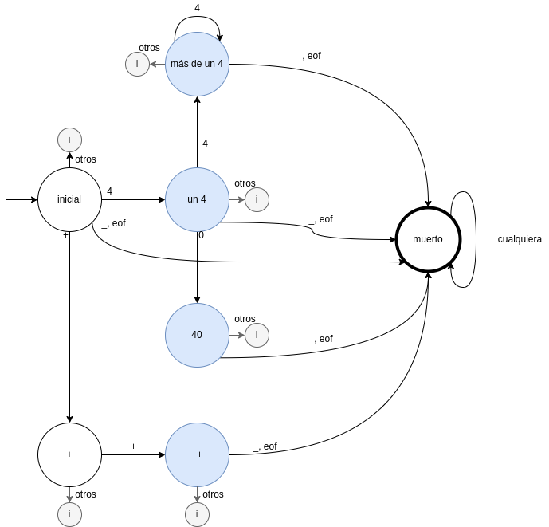

# Laboratorio 2: Resumen teórico

Breve repaso de lexers. Estados especiales del DFA de un lexer. Explicación de
un ejemplo de lex/flex.

## Bibliografía

Tiger book: 2.1, 2.2, 2.3
[Manual de flex](https://westes.github.io/flex/manual/).

## ¿Qué es un lexer? (tiger 2.1)

Un lexer convierte una secuencia de caracteres en una secuencia de **tokens**.

### Ejemplo

Fragmento de código:

```c
float matchO(char *s) { /* find a zero */
    if (!strncmp(s, "0.0", 3))
    return 0.;
}
```

Secuencia de tokens que podría extraer el lexer de C:

```python
    [
        
        (KEYWORD_FLOAT), (ID,"match0"), (LEFT_PAREN), (KEYWORD_CHAR), (STAR), (ID,"s"),(RIGHT_PAREN), (LEFT_BRACE),

        (KEYWORD_IF),(LEFT_PAREN),(BANG),(ID,"strcmp"),(LEFT_PAREN),(ID,"s"),(COMMA),(STRING,"0.0"),(COMMA),(NUM,"3"),(RIGHT_PAREN),(RIGHT_PAREN),

        (KEYWORD_RETURN),(REAL,"0."),(SEMICOLON),
        
        (RIGHT_BRACE),
        
        (EOF),
    ]
```

Notar que:

- El lexer hace desaparecer los comentarios
- El lexer hace desaparecer el espacio en blanco
- El lexer no interpreta `char*` como un puntero a `char` sino que unicamente
  reconoce `(KEYWORD_CHAR), (STAR)`. El lexer no extrae información semántica.

## ¿Cómo se describe un lexer? (tiger 2.2)

Para describir un lexer, lo único que necesitamos es un listado de expresiones
regulares. Las expresiones regulares que están más arriba tienen mayor prioridad
que las que están más abajo en la lista.

### Ejemplo

Algunas de las expresiones regulares que podría haber en el ejemplo anterior:

| Expresión regular                    | tipo de token   |
| ------------------------------------ | --------------- |
| `float`                              | `KEYWORD_FLOAT` |
| `(`                                  | `LEFT_PAREN`    |
| `[0-9]+`                             | `NUM`           |
| `([0-9]+\.[0-9]*)\|([0-9]*\.[0-9]+)` | `REAL`          |
| `[a-z][a-zO-9]*`                     | `ID`            |

Notar que:

- `float` podría interpretarse como un `ID`, pero se interpreta como
  `KEYWORD_FLOAT`, debido a su posición en la lista
- `floated` sería un `ID` y no un `KEYWORD_FLOAT` con un `ed` colgando, debido a
  que el lexer busca la coincidencia más larga (_longest match_). **Tener esto
  en cuenta es muy importante para resolver los lexers automáticos, ya que
  lex/flex respeta el principio del _longest match_**

## DFA derivado de un lexer

Por medio de algunos algoritmos relativamente simples que no se describen aquí,
es posible convertir cualquier expresión regular en un DFA, y combinar estos DFA
para crear otro DFA "especial". Este DFA "especial" cumple todas las
formalidades matemáticas de un DFA pero se interpreta de una forma especial para
extraer tokens. Para lenguajes simples es posible intuir el DFA final sin pasar
por los pasos intermedios.

### Ejemplo de deivación de un DFA para un lexer

Este lenguaje se llama `4++`. Esta compuesto por 3 tipos de tokens, que pueden
estar separados por guiones bajos.

| Expresión regular | tipo de token |
| ----------------- | ------------- |
| `40`              | `CUARENTA`    |
| `4+`              | `CUATROS`     |
| `\+\+`            | `MAS_MAS`     |

Ejemplos de frases válidas |frase|tokens| |-|-|
|`4444++40`|`(CUATROS,4444),(MAS_MAS,++),(CUARENTA,40)`|
|`++++4444`|`(MAS_MAS,++),(MAS_MAS,++),(CUATROS,4444)`|
|`4__40`|`(CUATROS,4),(CUARENTA,40)`| |`404`|`(CUARENTA,40),(CUATROS,4)`|

Ejemplos de frases inválidas |frase|problema| |-|-| |`4+40`|el + debe estar
seguido de otro +| |`4 40`|el espacio es un caracter inválido| |`400`|se lexea
`40` pero ningun token empieza con `0`, el segundo `0` no se puede consumir|
|`hola`|ningún token empieza con `h`| |`440`|se lexea `(CUATROS,44)` y luego no
hay cómo consumir el `0`|

Autómata de cada expresión regular por separado:


Los autómatas derivados de lexers tienen los siguientes estados especiales:

- **Estado inicial**: siempre existe como un estado separado
- **Estado tokenizable**: en este estado los caracteres consumidos conforman el
  token. Son los estados de aceptación de los DFA de arriba
- **Estado inválido**: Cuando el DFA llega a este estado, el lexer lanza una
  excepción
- **Estado muerto**: Explicado a continuación

Autómatas unidos sin estado muerto:


Este autómata no sirve para un lexer. Analicemos 2 algoritmos distintos de lexer
para convencernos de esto.

- Optimista: cuando llega a un estado de aceptación, se detiene y emite un
  token. Esta implementación no es buena porque para el string `444` emite
  `(CUATROS,4),(CUATROS,4),(CUATROS,4)`
- Pesimista: Cuando llega al estado de aceptación intenta continuar y emite el
  token anterior al llegar al estado inválido. Funciona bien para `444` pero no
  para `44_40` porque, al consumir el caracter `_`, llega al estado inválido al
  igual que lo haría si consumiera una `h`. No permite diagnosticar errores
  correctamente.

La solución es incluir estados _muerto_. Los estados de tokens válidos no serán
estados de aceptación sino que lo será este último. El estado muerto señala de
forma unívoca.

Antes, introducimos una nueva notación para el estado inválido:


Autómatas unidos con estado muerto (los estados tokenizables se resaltan pero
**no son especiales matematicamente**):



Breve descripción del algoritmo que observa el autómata:

- Iniciar constantemente recorridos del autómata.
- Cada recorrido del autómata consume caracteres hasta alcanzar un estado
  inválido o un estado muerto.
  - En el primer caso (estado inválido) emitir un error.
  - En el segundo caso (estado muerto), emitir el token correspondiente al
    estado tokenizable anterior, si es posible.
- Reaprovechar el caracter utilizado para la última transición en el siguiente
  recorrido del autómata

## flex

Flex es un generador de lexers. Utiliza un formato de archivo especial para
generar un lexer escrito en `C`. Formato de un archivo flex:

```
definitions
%%
rules
%%
user code
```

En el laboratorio 2 se usa únicamente la sección `rules`. La sección `rules` es
una secuencia de expresiones regulares seguidas de algo de código C (siempre
llamadas a `printf` en el laboratorio 2). Código para el lenguaje cuyo autómata
se estudió previamente:

```
%%
40      { printf("CUARENTA %s\n",yytext); }
4+      { printf("CUATROS %s\n",yytext); }
\+\+      { printf("MAS_MAS %s\n",yytext); }
_       { }
.     { printf("ERROR"); exit(1); }
%%
```

Instrucciones para correr el archivo:

1. instalar `flex` y `gcc` con `apt`
2. Escribir el código de arriba en un archivo `ejemplo.lex`
3. `flex -i -I ejemplo.lex`
4. `gcc -g lex.yy.c -o ejemplo -ll`
5. `./ejemplo` consume texto por stdin y ejecuta lo correspondiente

## Prioridad entre reglas

Se introduce un nuevo token `4[0-9]`. Esta regla se escribe arriba de todo,
enconces no se detecta el token `CUARENTA` ni la instancia `44` de `CUATROS`.
**Variando la posición de la nueva regla se cambia la prioridad de la misma para
tokens del mismo largo**. Nótese que aún se detecta `444` (con `4[0-9]` arriba
de todo) como una instancia de `CUATROS`, debido a la prioridad del **_longest
match_** por sobre la posición de la regla.

```
%%
4[0-9]      { printf("CUARENTA_Y_PICO %s\n",yytext); }
40      { printf("CUARENTA %s\n",yytext); }
4+      { printf("CUATROS %s\n",yytext); }
\+\+      { printf("MAS_MAS %s\n",yytext); }
_       { }
.     { printf("ERROR"); exit(1); }
%%
```
