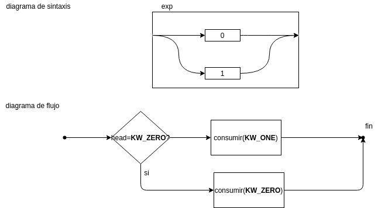
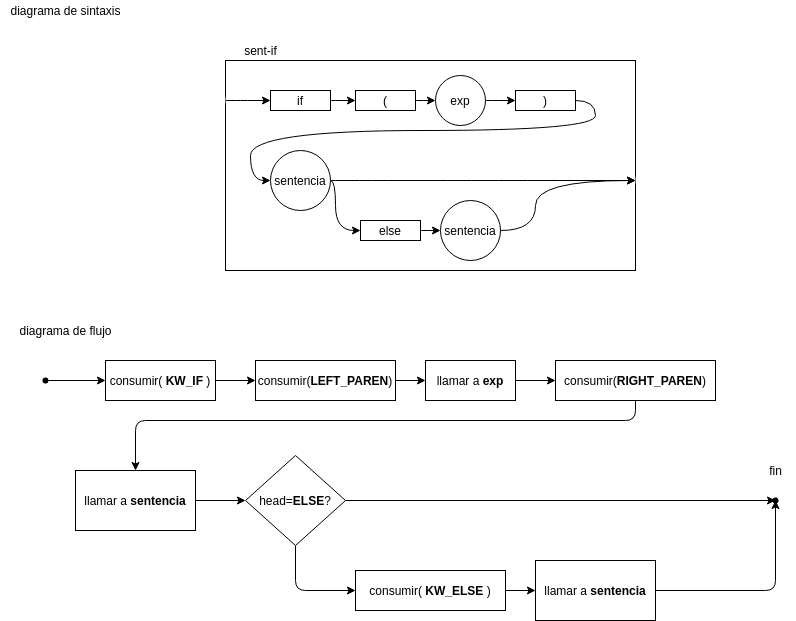

# Laboratorio 3: Resumen teórico

## Bibliografía
Louden 3.6

## ¿Qué es un parser?
Un parser toma una cadena de tokens y los convierte en un árbol de sintaxis.

### Ejemplo

Fragmento de código:
```c
float matchO(char *s) { /* find a zero */
    if (!strncmp(s, "0.0", 3))
    return 0.;
}
```

Secuencia de tokens que podría extraer el lexer de C:

```python
    [
        
        (KEYWORD_FLOAT), (ID,"match0"), (LEFT_PAREN), (KEYWORD_CHAR), (STAR), (ID,"s"),(RIGHT_PAREN), (LEFT_BRACE),

        (KEYWORD_IF),(LEFT_PAREN),(BANG),(ID,"strcmp"),(LEFT_PAREN),(ID,"s"),(COMMA),(STRING,"0.0"),(COMMA),(NUM,"3"),(RIGHT_PAREN),(RIGHT_PAREN),

        (KEYWORD_RETURN),(REAL,"0."),(SEMICOLON),
        
        (RIGHT_BRACE),
        
        (EOF),
    ]
```

Fragmento de AST similar a lo que extrae el compilador de C :


## ¿Cómo se describe una sintaxis?
Por medio de una gramática libre de contexto, que son más expresivas que las expresiones regulares. Estas se pueden representar de las siguientes formas:
- BNF
- EBNF
- Diagramas de sintaxis

### Representación BNF (ejemplo de Louden 4.10)

En esta representación, la gramática se representa como reglas de derivación:

```
<sentencia> ::= <sent-if>
<sentencia> ::= otro
<sent-if> ::= if ( <exp> ) <sentencia> <parte-else>
<parte-else> ::= else <sentencia>
<parte-else> ::= 
<exp> ::= 0
<exp> ::= 1
```

### Representación EBNF
Se agrega la `|` para indicar alternativas, `{ }` para indicar repetición 0 o más veces, `[ ]` para indicar que algo es opcional.

```
<sentencia> ::= <sent-if> | otro
<sent-if> ::= if ( <exp> ) <sentencia> [else <sentencia>]
<exp> ::= 0 | 1
```
Ejemplo: LUA https://www.lua.org/manual/5.3/manual.html#9

### Diagramas de sintaxis (Louden 3.5.2)
Representación gráfica de la EBNF. Su interpretación como diagrama de flujo permite extraer facilmente parsers descendientes recursivos.


Ejemplo: SQLite https://www.sqlite.org/syntaxdiagrams.html#select-stmt

## Parsers descendientes recursivos

Los parsers descendientes recursivos son programas en los que cada función se corresponde de forma directa con una regla de la sintaxis. Verifican que una lista de tokens conforme cierta gramática y pueden hacer únicamente 2 operaciones sobre una cola de tokens: observar el siguiente token ó consumirlo. **No pueden "ver" más allá del primer token.**

A continuación se expone un ejemplo de conversión de un diagrama de sintaxis a un programa. Aquí, 
- `void head()` retorna el tipo de token del siguiente token que no fue consumido
- `void consumir(int token_type)` **verifica** que el tipo de token de `head()` es `token_type`. Si esta condición se cumple, lo remueve de la cola. Si no se cumple, hay un **error de sintaxis**. Imprime un error y llama `exit(1)`.

### Sentencia


```c
void sentencia(){
    if(head()==OTRO){
        consumir(OTRO);
    }else{
        sent_if();
    }
}
```


### Exp



```c
void expr(){
    if(head()==KW_ZERO){
        consumir(KW_ZERO);
    }else{
        consumir(KW_ONE);
    }
}
```

### sent-if



```c
void sentif(){
    consumir(KW_IF);
    consumir(LEFT_PAREN);
    expr();
    consumir(RIGHT_PAREN);
    sentencia();
    if(head()==KW_ELSE){
        consumir(KW_ELSE);
        sentencia();
    }
}
```
