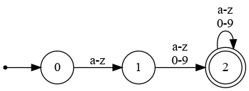
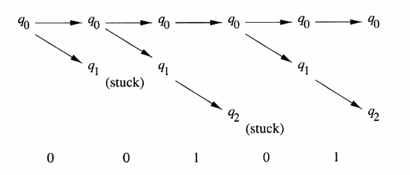

### Introducción  [dragon-3]

Como la primera fase de un compilador la principal tarea del analizador léxico es:

-   leer los caracteres de la entrada del programa fuente,

-   agruparlos en lexemas

-   y producir como salida una secuencia de tokens para cada lexema del programa fuente.

-   Interactúa con:
    -   El analizador sintáctico para su análisis
    -   También con la tabla de símbolos.

1.  Análisis Léxico vs Análisis Sintáctico

    Existen varias razones por la cual separar al análisis léxico del análisis sintáctico dentro de un compilador:
    
    1.  La sencillez del diseño es la consideración más importante -> permite simplificar alguna de las dos tareas.
    
    2.  Se mejora la eficiencia del compilador. Escribir el lexer separado permite aplicar técnicas especificas que sólo sirven para esta tarea.
    
    3.  Se mejora la portabilidad del compilador -> Las particularidades de los dispositivos de entrada se restringen solo al lexer.

2.  Definiciones

    1.  Token
    
        -   Un token es un par que consiste en un nombre de token y un valor de atributo opcional
        
        -   El nombre del token es un símbolo abstracto que representa un tipo de unidad léxica; por ejemplo una palabra clave, un identificador. Es una **palabra clasificada**.
            -   Son los símbolos de entrada del analizador sintáctico.
    
    2.  Patrón
    
        -   Un patrón es una descripción de la forma que pueden tomar los lexemas de un token. En el caso de una palabra reservada como token, el patrón es sólo la secuencia de caracteres que forman la palabra reservada.
    
    3.  Lexema
    
        -   Es una secuencia de caracteres en el programa fuente, que coinciden con el patrón para un token y que el analizador léxico identifica como una instancia de ese token


### Expresiones Regulares: Introducción

Las **expresiones regulares son lenguajes para expresar patrones**. Fueron descriptas en 1950 por **Stephen Kleene** como un elemento de su trabajo fundacional en la teoría de autómatas y computabilidad. Actualmente, las expresiones regulares son ampliamente utilizadas por distintos tipos de programas ( editores de texto, programas de linea de comando,etc.

1.  Alfabeto

    -   **Alfabeto** es un conjunto finito de símbolos. Se denomina con una letra griega &Sigma;.
        1.  &Sigma;1={0,1} &rarr; alfabeto binario
        2.  &Sigma;2={a,b} &rarr; alfabeto formado por las letras a y b
        3.  &Sigma;3={I,V,X,L,C,D,M} &rarr; alfabeto formados por los símbolos de los números romanos
        4.  ASCII &rarr; es un alfabeto, cumple con la definición
        5.  UTF-8 &rarr; es un alfabeto también.

2.  Cadena

    -   Una **cadena** sobre un alfabeto es una secuencia finita de símbolos que se extraen de un determinado alfabeto. Normalmente en teoría del lenguaje los término "palabra" y "oración" se utilizan como sinónimos.
    
    -   Una cadena se denota con la letra *s*.
    
    -   Todas las cadenas de determinada longitud **k** que se pueden construir con un alfabeto &Sigma; se representan convencionalmente &Sigma;<sup>k</sup>
    
    -   Por ejemplo, dado el alfabeto &Sigma;= {a, b}, se dan las siguientes extensiones:
        -   &Sigma;<sup>0</sup> = {&empty;}
        -   &Sigma;<sup>1</sup> = {a, b}
        -   &Sigma;<sup>2</sup> = {aa, ab, ba, bb}
        -   &Sigma;<sup>3</sup> = {aaa, aab, abb, aba, bbb, bba, baa, bab}&#x2026;
    
    -   Para representar el conjunto de todas las cadenas posibles que se pueden obtener a partir de un alfabeto &Sigma; se usa la notación &Sigma;&lowast;. En términos de teoría de conjuntos, &Sigma;&lowast; = {&Sigma;<sup>0</sup> &cup; &Sigma;<sup>1</sup> &cup; &Sigma;<sup>2</sup> &cup; &Sigma;<sup>3</sup> ∪ &Sigma; ^{4} &cup; &#x2026;}
    
    -   La longitud de una cadena |s|.
    
    -   La cadena vacía se representa por &epsilon;, cuya longitud es cero.

3.  Lenguaje

    Un **lenguaje** es cualquier conjunto contable de cadenas sobre algún alfabeto fijo.
    
    -   Operaciones más importantes en los lenguajes son:
        
        -   **Unión**: es la misma operación que se realiza con los conjuntos.
        
        -   **Concatenación**: La concatenación de lenguajes es cuando se concatenan todas las cadenas que se forman al tomar la primer cadena del primer lenguaje y una cadena del segundo lenguaje , en todas las formas posibles.
        
        -   **Clausura Positiva**: de un lenguaje L, se denota como L(s<sup>+</sup>). En términos de teoría de conjuntos, &Sigma;+ = { &Sigma;<sup>1</sup> &cup; &Sigma;<sup>2</sup> &cup; &Sigma;<sup>3</sup> &cup; &Sigma;<sup>4</sup> &cup; &#x2026;}
    
        -   La **Clausura de Kleene**: de un lenguaje L, se denota como L(s<sup>&lowast;</sup>). En términos de teoría de conjuntos, &Sigma;&lowast; = {&Sigma;<sup>0</sup> &cup; &Sigma;<sup>1</sup> &cup; &Sigma;<sup>2</sup> &cup; &Sigma;<sup>3</sup> &cup; &Sigma;<sup>4</sup> &cup;&#x2026;}

4.  Expresión regular

    Una **expresión regular** *s* es una cadena que denota L(s), un conjunto de cadenas derivados a partir de un alfabeto &Sigma;. L(s) es conocido como "Lenguaje de s"
    
    L(s) se define inductivamente con los siguientes casos base:
    
    1.  Si **a** es un símbolo que pertenece a &Sigma;, entonces **a** es una expresión regular, y L(a)={a}, es decir el lenguaje con una cadena de longitud uno, con *a* en su única posición
    
    2.  &epsilon; es una expresión regular, y L(&epsilon;) = {&epsilon;}, es decir el lenguaje cuyo único miembro es la cadena vacía.
    
    hay cuatro partes que constituyen la inducción,mediante la cual las expresiones regulares más grandes se construyen a partir de las más pequeñas. Entonces, para cualquier expresión regular *s* y *t*,y denotan a los lenguajes L(s) y L(t) :
    
    1.  (s)|(t) es una Expresión Regular tal que L(s|t)=L(s) U L(t).
    
    2.  (s)(t) es una expresión regular tal que L(st) contiene todas las cadenas formadas por la concatenación de una cadena de L(s) seguida por una cadena de L(t).
    
    3.  (s)<sup>&lowast;</sup> es una expresión regular tal que ( L(s)<sup>\*</sup> )= L(s) concatenado cero o muchas veces.
    
    4.  (s) es una expresión regular que denota al lenguaje L(s)
    
    Tener en cuenta que:
    
    1.  El operador unario &lowast; tiene la precedencia más alta y es asociativo a la izquierda.
    2.  La concatenación tiene la segunda precedencia más alta y es asociativa a la izquierda.
    3.  | tiene la precedencia más baja y es asociativa a la izquierda
    
    recordar:
    
    | Propiedad           | Ejemplo                              |
    | ------------------- | ------------------------------------ |
    | asociatividad  | a&vert;(b&vert;c) = (a&vert;b)&vert;c |
    | Conmutatividad | a&vert;b = b&vert;a                   |
    | distribución   | a(b&vert;c)= ab&vert;ac               |
    | idempotencia   | a\*\* = a\*                           |
    
    -   Desde Kleene se han ampliado varios operadores para mejorar la habilidad de especificar patrones, algunos de ellos son :
        
        1.  Una o mas instancias. El operador unario post-fijo **+** representa la clausura positiva de una expresión regular.
        
        2.  Cero o una instancia. El operador post-fijo **?**. Es equivalente a r&vert;&epsilon; , o dicho de otra forma L(r?)= L(r) U L(&epsilon;)
        
        3.  Clases de caracteres. [a-z] rango de letras minúsculas . Otra forma es utilizando el operador &vert;

5.  Ejemplos

    -   Un identificador es una secuencia de letras mayúsculas y números, pero un numero nunca puede estar primero:
    
    | expresión regular | [A-Z]+([A-Z] &vert; [0-9] )&lowast; |
    | -------------------------- | ----------------------------------------------- |
    | verifican la rexp | PRINT                               |
    |                   | MODE5                               |
    |                   |                                     |
    | NO VERIFICAN      | print                               |
    |                   | 5contador                           |
    
    -   Un número es una secuencia de dígitos con un punto decimal opcional. Como nota el punto decimal debe tener dígitos a ambos lados:
        
        | expresión regular | [A-Z]+([A-Z] &vert; [0-9] )&lowast; |
        | ------------------------- | ------------------------------------------------ |
        | verifican la rexp | PRINT                               |
        |                   | MODE5                               |
        |                   |                                     |
        | NO VERIFICAN      | print                               |
        |                   | 5contador                           |
    
    Tabla de expresiones regulares comunes:
    
    | Expresión | Descripción                                    |
    | --------------- | --------------------------------------------- |
    | .         | Any character is required.                     |
    | a         | The character a is required.                   |
    | [abcdef]  | Any character in the set abcdef is required.   |
    | [a-f]     | Any character in the range a to f is required. |
    | a?        | The character a is optional.                   |
    | a\*       | Zero or more of the character a are required.  |
    | a+        | One or more of the character a are required.   |
    | \\^       | The start of input is required.                |
    | \\$       | The end of input is required.                  |


### Reconocimiento de Tokens

-   Una vez con capacidad para expresar patrones usando expresiones regulares es necesario estudiar como tomar todos los patrones para todos los tokens necesarios. Además, construir una pieza de código que examine la cadena de entrada y busque un prefijo que sea un lexema que coincida con esos patrones.
-   Por ejemplo:

```
inst -> if expr then instr
      | if expr then instr else instr 
      | &epsilon;                     

expr -> term oprel term
      | term |
   
term -> id 
     | numero 
```

Las terminales de la gramática, que son **if**, **then**, **else**, **oprel** (operación relacional), **id**, **numero** corresponden a los nombres de los tokens que el analizador léxico respecta. A continuación se escriben los patrones para estos tokens que se describen como expresiones regulares:

```
digito   -> [0-9] 
digitos  -> digito+ 
numero   -> digitos(.disgitos)? (E[=-]? digitos) ? 
letra    -> [A-Za-z]
id       -> letra (letra &vert; digito)\* 
if       -> T_IF 
then     -> T_THEN 
else     -> T_ELSE 
oprel    -> < | > | <= | >= | = | <> 
ws       -> ( \n\n)+
```

### Autómatas Finitos

(Dou:p15)(Hop:31)

-   Se dice que un **Autómata Finito** es una **máquina abstracta que puede ser utilizada para representar ciertas formas de cómputo**. Gráficamente un AF consiste en un número de **estados** y **un numero de vértices** entre esos estados. Cada uno de estos vértices se etiqueta con uno de los símbolos de un alfabeto.

-   La máquina siempre comienza en el estado S<sub>0</sub>. Para cada símbolo de entrada que se presente al AF, este se mueve al estado indicado por el vértice con la misma etiqueta que el símbolo de entrada.

-   Algunos estados de AF son conocidos como **accepting states** (estados de aceptación o finales) estos se marcan con un doble circulo.

-   Si un AF se encuentra en un estado de aceptación después de consumir todo el input, entonces se dice que el AF acepta el input. Se dice que rechaza el string de entrada si este termina en un estado no final.

-   Cada Expresión Regular puede ser transformada en un Autómata Finito y viceversa.

-   Ejemplo1: palabra reservada **for**:


-   Ejemplo2: Reconocimiento de identificadores [a-z][a-z0-9]+



-   Ejemplo3: AF para reconocer números de la forma ([1-9][0-9]&lowast;)&vert;0:


1. Autómatas Finitos Deterministas

   (lou:p49) Un **autómata finito determinista** o **DFA** *M* se compone de un alfabeto &Sigma;, un conjunto de estados D, una función de transición T:S x &Sigma; -> S, un estado inicial S<sub>0</sub> &isin; S y un conjunto de estados de aceptación A perteneciente a S.

El lenguaje aceptado por *M*, se escribe como L(M), se define como el conjunto de cadenas de caracteres c<sub>1</sub>c<sub>2</sub>&#x2026;.c<sub>n</sub> con cada c<sub>i</sub> &isin; &Sigma;, tal que existen estados S<sub>1</sub>=T(s<sub>1</sub>,c<sub>1</sub>), S<sub>2</sub>=T(s<sub>2</sub>,c<sub>2</sub>)&#x2026;. S<sub>n</sub>=T(s<sub>n</sub>,c<sub>n</sub>) con S<sub>s</sub> un elemento de A, es decir un estado de aceptación.

   -   S x &Sigma; se refiere al producto cartesiano
   -   La función T registra transiciones de estado: T(s,c)=s'

   

   -   La aceptación como la existencia de una secuencia de estados S<sub>1</sub>&#x2026;..S<sub>n</sub> siendo S<sub>n</sub> un estado de aceptación.
       
       En otras palabras:
       
       un DFA es un autómata finito que además es un sistema determinista; es decir:
       
       -   para cada estado en que se encuentre el autómata, y con cualquier símbolo del alfabeto leído, **existe siempre no más de una transición posible desde ese estado y con ese símbolo**.

   1. Ejemplo de DFA:

      

      - S={S0,S1,S2} (conjunto de estados)

      - S0 es el estado inicial

      - &Sigma;={0,1} (alfabeto)

      - A={S2} (conjunto de estados de aceptación)

      - T función de transición: T(S0,0 )= S1 T(S0, 1)= S0 T(S1, 0)= S1 T(S1, 1)= S2 T(S2, 0)= S2 T(S2, 1)= S2

        

      Se define el autómata finito deterministico en función de una quíntupla de la siguiente forma M=(S, S0, Σ, A, T)

      

   2.  La función de transición extendida y la tabla de transiciones:

       Sea el siguiente autómata :
       
       
       
       definido formalmente por la quíntupla :
       
       A=(Q, &Sigma;, &delta;, q<sub>0</sub>, F)
       
       La tabla de transición se arma, poniendo haciendo una tabla de doble entrada entre los símbolos del alfabeto y los estados del autómata.
       
       La tabla de transición del autómata viene dada por:
       
       |                   | 0             | 1             |
       | -------------- | ------------ | ----------- |
       | -> S<sub>0</sub>  | S<sub>1</sub> | S<sub>0</sub> |
       | S<sub>1</sub>     | S<sub>1</sub> | S<sub>2</sub> |
       | \*  S<sub>2</sub> | S<sub>2</sub> | S<sub>2</sub> |
       
       Esta tabla puede usarse para verificar si una cadena pertenece al lenguaje, por ejemplo:11010
       
       
       
       A su vez se define a la **función de transición extendida** \\<sup>&delta;</sup>, llamada delta hat o delta sombrero. Esta es una función de dos variables \\<sup>&delta;</sup>(q<sub>0</sub>,w), donde w es una cadena.
       
       Sea w=11011 entonces
       
       \\<sup>&delta;</sup>(q<sub>0</sub>,w)=q<sub>2</sub>
       
       

2.  Autómatas Finito No Deterministas

    Un **Autómata Finito No Determinista** o **NFA** M consta de un alfabeto &Sigma;, un conjunto de estados S, una función de transición T: S x ( &Sigma; &cup; {&epsilon;} ) &rarr; \wp()(S), así un estado de inicio s<sub>0</sub> de S y un conjunto de estados de aceptación A de S.
    
    El Lenguaje aceptado por M, escrito por L(M), se define como el conjunto de cadenas de caracteres c<sub>1</sub>c{2}&#x2026;c<sub>n</sub> con cada c<sub>i</sub> de &sigma; &isin; (&epsilon;) tal que existen estados s<sub>1</sub> en T(s<sub>0</sub>,c1) &#x2026;.. con s<sub>n</sub> un elemento de A.
    
    
    
    -   ¿Dónde está la diferencia?
    
    La diferencia está en que para un mismo símbolo del alfabeto existen múltiples posibles transiciones, o incluso puede no existir transición. Por ello el autómata se denomina **No Determinista**.
    
    La Clave está en la función de transición : T: S x ( &Sigma; &cup; {&epsilon;} ) &rarr; \wp()(S),
    
    1.  Ejemplo de NFA
    
        
        
        Analisis de hilos en un NFA, dada la cadena: 00101 realizar el análisis de hilos.
        
        
    
    2.  La tabla de transiciones:
    
        Si se tiene en cuenta la definición formal de un **automata finito no determinista**:
        
        A=(Q, &Sigma;, &de lta;, q<sub>0</sub>,F), donde:
        
        1. Q es un conjunto de estados.
        
        2. &Sigma; es un conjunto finito de símbolos de entrada, un alfabeto.
        
        3. q<sub>0</sub>, un elemento de Q, que es el estado inicial.
        
        4. F, un subconjunto de Q de estados de aceptación.
        
        5. &delta; la función de transición que toma un estado de Q y un símbolo de &Sigma; como argumentos y devuelve un **subconjunto de Q**.
        
           
        
        Dado el ejemplo anterior, obtener la tabla de transiciones para w=00101:
        
        
        
        |      | 0    | 1  |
        | --- | ----- | -- |
        | &larr; S<sub>0</sub>   | {S<sub>0</sub>,S<sub>1</sub>} | {S<sub>0</sub>} |
| S<sub>1</sub>         | &empty;                   | {S<sub>2</sub>  |
| &lowast; S<sub>2</sub> | &empty;                       | emptyset        | |

### Un Poco de Código

(lou)

1.  Un Token:

    ```C
    typedef enum {IF, THEN, ELSE , PLUS,NUM, ID  } token_type;
    
    typedef struct {
        token_type token_val;
        char * string_val;
        int num_val;
    } TOKEN;
    
    ```
    
    o
    
    ```C
    typedef enum {IF, THEN, ELSE , PLUS,NUM, ID  } token_type;
    
    typedef struct {
        token_type token_val;
    
        union{
    	char * string_val;
    	int num_val;
        } atributos;
    
    } TOKEN;
    
```

2.  La Tabla de Símbolos:

    (Ben:65) A medida que se va realizando el proceso de compilación es necesario buscar nombres en la **Tabla de Símbolos**, para ver si un identificador ha sido declarado. Esto además tiene que ser hecho de una forma muy eficiente, un arreglo de registro o por una lista enlazada son una estructura muy ineficiente para las búsquedas, para ello es necesario y una **Tabla de Hash Abierto**:
    
    ```C
    struct symbol_table{
        struct symbol_table* siguiente;
        char*                nombre;
        int                  tipo;
        int                  block_no;
        int                  direccion;              
    }
```

3.  Un lexer

    (dra,lou)
    
    Para mostrar como es la arquitectura de un analizador léxico a partir de autómatas se utilizará el siguiente autómata que representa el reconocimiento de las operaciones de relación:
    
    
    
    tener en cuenta que el símbolo &lowast; implica que se debe retroceder la entrada en un caracter.
    
    
    
    para implementar un analizador gráfico a partir de un automata, en primer lugar se debe pensar en una variable llamada **estado**, que contenga el **estado actual** en el que se encuentra el autómata. Una instrucción **switch** que esté basada en el valor del estado y para cada uno de estos valores se ejecutara el código necesario para cada uno de los estados. Un ejemplo en C:
    
```C
    
    TOKEN * ObtenerOpRel(){
        TOKEN * token_ret= malloc(TOKEN);
    
        while(1){
    	switch (estado) {
    	    case 0: c=sig_char();
    		    if (c == '<') estado =1;
    		    else if (c == '=') estado = 5;
    		    else if (c == '>') estado = 6;
    		    else error(); /*el lexema no es un operacion relacional */    
    		    break;
    	    case 1:  ...
    	    case 2:  ...
    	    case 3:
    	    ...
    
    	    case 8: retroceder();
    		    token_ret->val= GD;
    		    return (token_ret);
    	} 
        }
    }
```
    
Dado que esto último se debe realizar por cada tipo de token, el programar a mano un analizador léxico de un lenguaje de programación se torna una cuestión muy compleja. Por ello normalmente se utilizan **Generadores de Analizadores Léxicos**
